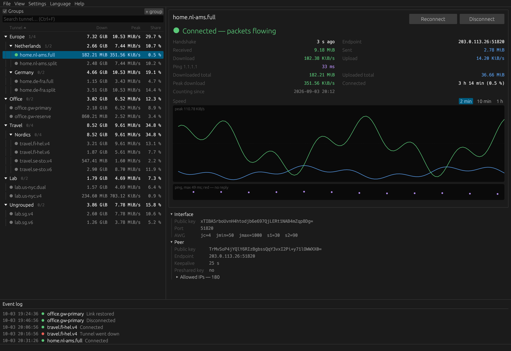
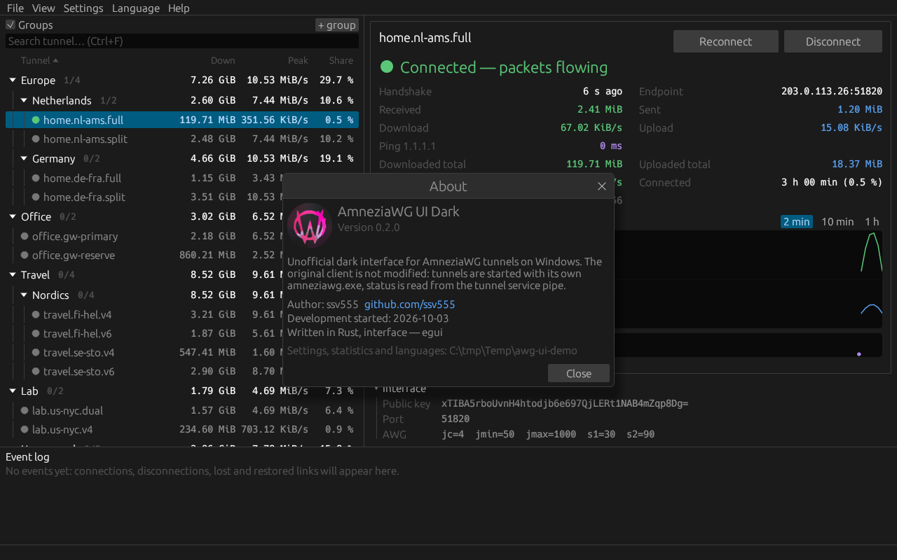

<p align="right"><a href="README.md">English</a> | <b>Русский</b></p>

<h1 align="center">AmneziaWG UI Dark</h1>

<p align="center">
  Тёмный и быстрый неофициальный интерфейс для туннелей <a href="https://amnezia.org">AmneziaWG</a> в Windows:
  группы, живое состояние, график скорости, пинг, статистика и значок в трее - родной клиент остаётся нетронутым.
</p>

<p align="center">
  
  
  
  
  
</p>

<p align="center">
  
</p>

> Снимки сделаны во встроенном демо-режиме (`--demo`): выдуманные туннели и статистика, AmneziaWG и права
> администратора не нужны. Попробовать самому: `awg-ui.exe --demo`. Интерфейс на снимках английский - это язык по
> умолчанию, русский переключается в меню **Язык**.

## Возможности

**Список туннелей**
- Вложенные группы любой глубины (`Europe/Netherlands`) - деревом или плоским списком. Строка группы показывает
  итоги всего поддерева: активные/всего, скачано, отдано, пиковую скорость и долю времени.
- Перетаскивание туннелей и групп мышью, меню по правому клику, управление с клавиатуры, мгновенный поиск (`Ctrl+F`).
- Экранный диктор (Narrator, NVDA): строки туннелей и групп, график скорости и точки состояния читаются с именем и состоянием.
- Колонки с сортировкой и шириной по содержимому: скачано всего, отдано всего, пик, доля времени подключения.

**Состояние в реальном времени**
- Есть ли рукопожатие и как давно, идут ли пакеты, скорость загрузки и отдачи, пинг через VPN. Числа - моноширинным
  шрифтом в ячейках равной ширины, поэтому при смене значений ничего не прыгает.
- График скорости (2 мин / 10 мин / 1 ч) со шкалой скоростей справа и полоса пинга под ним; кнопка паузы замораживает оба, можно навести мышь на пики.
- Статистика по каждому туннелю с первого запуска: трафик, пиковая скорость, время подключения и его доля среди всех.
- Журнал событий: подключения, отключения, потеря и восстановление связи; фильтр по важности и туннелю, поиск, копирование, сохранение в файл.
- Если ядро перестало отвечать, туннели показывают «Неизвестно: нет связи с ядром» вместо догадки, значок в трее и
  строка состояния предупреждают, а когда ядро снова отвечает, всё возвращается само.

**Удобство**
- Цветная точка на значке в трее и на кнопке в панели задач (значок поверх кнопки) показывает состояние; уведомления Windows, когда
  связь пропала или вернулась. Щелчок по уведомлению открывает окно на этом туннеле.
- **Меню трея** (правая кнопка на значке): «Открыть окно», туннели (по группам, если окно показывает группы;
  подключённые отмечены) и «Выход». Щелчок по туннелю подключает или отключает его так же, как окно (отключение — после вопроса), с учётом
  настройки «Несколько туннелей одновременно». Без связи с ядром состояние неизвестно: меню пишет об этом первой
  строкой, туннели без отметок и недоступны (окно показывает «Неизвестно: нет связи с ядром», кнопка
  «Подключить» / «Отключить» серая).
- **Режим работы виден сразу**: в режиме встроенного движка иконка (окно, панель задач, трей) жёлтая, разделители и
  рамки - неоново-жёлтые, в строке состояния - название режима.
- **Несколько туннелей одновременно** (Настройки): независимые туннели работают рядом; туннель, который не может
  работать вместе с подключённым (общий адрес или оба на весь трафик), заменяет его, причина пишется в журнал.
- **VPN не зависит от окна**: туннели, статистика и журнал живут в службе ядра; закройте окно - всё продолжает
  работать. Окну не нужны права администратора - после установки ядра никаких запросов UAC.
- **Туннели возвращаются после перезагрузки, пропадания питания или обрыва**: ядро переподключает оставленный вами
  туннель каждые 10 с первые 3 минуты, раз в минуту до 10 минут, дальше раз в 10 минут и сразу при смене сети.
- **Выход спрашивает о VPN**, если туннели подключены: отключить и выйти или выйти, оставив VPN. Выбор можно
  запомнить; **Настройки → Настройки… → Снова показывать скрытые диалоги** вернёт вопрос.
- **Без случайных отключений**: двойной щелчок или `Enter` по строке туннеля только подключают; по подключённому туннелю
  они ничего не делают. **Отключить** (кнопка карточки, меню строки, трей) сначала спрашивает, с галочкой **Больше не
  спрашивать** (**Настройки → Настройки… → Снова показывать скрытые диалоги** вернёт вопрос). Когда «Несколько туннелей
  одновременно» выключено, подсказка у **Подключить** называет туннели, которые оно отключит.
- Каждую панель можно включить или выключить в меню **Вид**; поведение настраивается в окне **Настройки…** (разделы «Общие» с выбором темы, «Уведомления и трей», «Сеть»,
  «Режим работы»; **ОК** / **Отмена** / **Применить**, **Сбросить** с подтверждением). Узел пинга там проверяется: имя
  узла или адрес IPv4, иначе окно показывает ошибку и не сохраняет.
- **Скопировать диагностику** (**Справка → Скопировать диагностику**, а также кнопка в **О программе**): текстовый отчёт для обращения о неполадке уходит в буфер обмена - версии, режим, Windows, состояние ядра и агента, имена туннелей с состоянием, последние 50 событий, версии компонентов. Ключи, адреса, имена хостов, имена пользователя и компьютера вырезаются, путь профиля заменяется на `%USERPROFILE%`.
- **Обновления и откаты** (**Справка → Проверить обновления…**): оригинальный AmneziaWG, встроенный движок и сама
  программа - каждый отдельно или все сразу. Перед каждым обновлением и откатом текущая версия сохраняется в резервную
  копию; в таблице истории у каждой копии есть кнопка **Вернуть** (возврат запрашивает права администратора через
  UAC - так никакая другая программа не откатит компонент молча). Скачанное проверяется до установки: установщик
  AmneziaWG - по SHA-256 и подписи издателя, наши движок и программа - по подписанному манифесту. Если обновлённое
  ядро не запустилось, прежняя сборка возвращается автоматически вместе с заменёнными с ней файлами движка, а история
  показывает этот возврат. Раз в сутки
  программа сама проверяет обновления и помечает меню **Справка**; сама она ничего не ставит. О новой версии
  сообщается один раз: справа внизу появляется небольшое уведомление (**Открыть** / **Позже**; его можно перетащить за
  заголовок, крестик и `Esc` - то же, что **Позже**), оно не отнимает фокус
  и не блокирует окно; если окно скрыто в трее, Windows показывает ещё и своё уведомление.
- Чёткий на любом экране: интерфейс следует масштабу Windows для каждого монитора (Full HD, 2K, 4K, 8K), а поверх
  него его можно увеличить или уменьшить в **Вид -> Масштаб интерфейса** или `Ctrl+Плюс` / `Ctrl+Минус`.
- Три темы: Графит (тёмная, по умолчанию), Сланец (мягкая сине-серая тёмная) и День (светлая) или «Как в Windows»;
  переключаются на лету в **Настройки…**, заголовок окна следует теме. Английский по умолчанию, русский встроен,
  свой язык добавляется просто.

**Работа с конфигами**
- Правка, импорт и удаление туннелей через родное окно AmneziaWG: оно управляется автоматически (UI Automation).
- Привязка туннеля к его обычному файлу `.conf` (источнику) и синхронизация в обе стороны.
- Встроенный редактор `.conf` с кнопкой «Импортировать в AmneziaWG». При закрытии с несохранёнными изменениями
  спрашивает **Сохранить** / **Не сохранять** / **Отмена**.
- **Режим встроенного движка** - работает без установленного AmneziaWG: своё зашифрованное хранилище туннелей,
  импорт из `.conf` / `.zip` или одной кнопкой из AmneziaWG, резервные копии под паролем (см. [Режимы работы](#режимы-работы)).

## Как это устроено

У программы две части:

- **Ядро** - служба Windows (`AwgUiCore`, работает от имени системы, запускается вместе с Windows). Хранит режим
  работы, подключает и отключает туннели, раз в секунду опрашивает их состояние, ведёт статистику и журнал событий,
  пингует. Работает и при закрытом окне. Если один из его внутренних потоков откажет, ядро останавливается само, а
  Windows перезапускает службу в течение секунд; причина записывается в `events.log`.
- **Окно** - только интерфейс. Говорит с ядром по именованному каналу, открыть который могут только ваша учётная
  запись, администраторы и система, и **прав администратора не требует** вовсе. Закрытие окна VPN не трогает. Если само
  окно встретит внутреннюю ошибку, оно покажет сообщение, запишет `logs\crash.log` и завершится; ядро и туннели это
  не затрагивает.

В режиме поверх AmneziaWG (по умолчанию) ядро ничего не подменяет и не патчит в официальном клиенте, а пользуется
тем, что там уже есть.

1. **Список туннелей** - зашифрованные файлы `*.conf.dpapi` в `C:\Program Files\AmneziaWG\Data\Configurations\`.
   Конфиги зашифрованы под SYSTEM; программа их не читает, а только передаёт путь службе.
2. **Подключение и отключение** - `amneziawg.exe /installtunnelservice <путь>` и `/uninstalltunnelservice <имя>`;
   те же команды выполняет менеджер родного клиента.
3. **Состояние** - UAPI-канал службы туннеля (`\\.\pipe\ProtectedPrefix\Administrators\AmneziaWG\<имя>`), запрос
   раз в секунду. Туннель запущен, пока существует его канал.
4. **Пинг** - ICMP до выбранного узла (по умолчанию `1.1.1.1`) раз в 10 секунд, пока подключён хотя бы один туннель.
5. **Правка, импорт, удаление** - родным окном AmneziaWG управляет Windows UI Automation. Для этого ядро запускает
   в вашем сеансе копию программы-помощника (родное окно работает с правами администратора). Сохраняет и шифрует
   всегда сам родной клиент; его зашифрованное хранилище программа не читает. Для этих действий ваша учётная запись
   должна быть администратором (этого требует само родное окно); всё остальное работает и для обычной.

Права администратора нужны один раз - чтобы установить ядро: при первом запуске окно показывает **Установить ядро**
(один запрос UAC). После обновления программы окно так же предлагает **Обновить ядро**. Повторный запуск окна просто
показывает уже открытое.

## Требования

- Windows 10 или Windows 11 (x64).
- Установленный официальный клиент [AmneziaWG для Windows](https://github.com/amnezia-vpn/amneziawg-windows-client) -
  только для режима по умолчанию (встроенный движок и демо-режим работают и без него).
- Права администратора один раз - для установки службы ядра (один запрос UAC). Само окно работает без них.

## Установка

### Готовая сборка

Скачайте `awg-ui.exe` из [последнего релиза](https://github.com/ssv555/AmneziaWG-UI-Dark/releases/latest), положите в
любую папку и запустите. Устанавливать ничего не нужно: это один переносимый файл без сред выполнения (ни Visual C++
Redistributable, ни .NET); настройки, статистика, журналы и языки лежат рядом с ним. Что менялось в каждой версии -
в [истории версий](CHANGELOG.ru.md).

Exe пока не подписан цифровой подписью, поэтому при первом запуске Windows SmartScreen может предупредить:
**Подробнее -> Выполнить в любом случае**.

### Сборка из исходников

1. Установите [Rust](https://rustup.rs) с набором **MSVC** (`stable-x86_64-pc-windows-msvc`).
2. Установите Visual Studio Build Tools и **Windows SDK**: для вшивания иконки в exe нужен `rc.exe`.
3. Склонируйте и соберите:

   ```powershell
   git clone https://github.com/ssv555/AmneziaWG-UI-Dark.git
   cd AmneziaWG-UI-Dark
   cargo test --release
   cargo build --release
   ```

4. Результат - `target\release\awg-ui.exe`.

## Как пользоваться

Запустите `awg-ui.exe`, выберите туннель и нажмите **Подключить / Отключить** (или **Переподключить**) справа вверху.

### Горячие клавиши

| Клавиши | Действие |
|---------|----------|
| `Ctrl+F` | Поиск по туннелям (`Esc` - очистить) |
| `Вверх` / `Вниз` | Переход между строками |
| `Влево` / `Вправо` | Свернуть / раскрыть группу или перейти к родителю |
| `Enter`, двойной щелчок | Подключить туннель (не отключает: для этого кнопка или меню) либо свернуть / раскрыть группу |
| `F2` | Переименовать выбранную группу |
| `Delete` | Удалить выбранную группу или туннель (с подтверждением) |
| `Shift+F10` / клавиша меню | Контекстное меню выделенной строки, значения карточки или строки журнала под фокусом (фокус — клавишей `Tab`) |
| `F10` или одиночный `Alt` | Фокус на строку меню (выделено первое меню); `Влево` / `Вправо` - соседнее меню, `Вниз` или `Enter` открывает, `Esc` - шаг назад |
| `Alt+Ф`, `Alt+В`, `Alt+Н`, `Alt+Я`, `Alt+С` | Открыть **Файл**, **Вид**, **Настройки**, **Язык**, **Справка** (подчёркнутая буква; работает и в английской раскладке); в меню `Вверх` / `Вниз` - по пунктам, `Enter` - выполнить, `Вправо` открывает подменю, `Влево` закрывает |
| `Ctrl+N` / `Ctrl+I` | Новый туннель / импорт туннелей (режим встроенного движка) |
| `F1` / `F5` | О программе / проверить обновления |
| `Ctrl+S` | Сохранить во встроенном редакторе конфига |
| `Ctrl+Плюс` / `Ctrl+Минус` / `Ctrl+0` | Крупнее / мельче / снова 100 % |
| `Enter` / `Esc` в диалогах | Главная кнопка / отмена; `Esc` и крестик в заголовке отменяют или закрывают любое окно |

### Группы

- Правый клик по группе: новая подгруппа, переименовать, выше / ниже, на верхний уровень, удалить (её подгруппы и
  туннели переходят уровнем выше; из AmneziaWG туннели **не** удаляются).
- Правый клик по туннелю: **В группу** (дерево подменю).
- Перетащите туннель на группу - он окажется в ней; на «Без группы» или на пустое место - выйдет из группы.
  Группа на группу становится подгруппой. Недопустимое действие подсвечивается красной рамкой.

### Трей и автозапуск

- Закрытие окна сворачивает его в трей; **Файл -> Выход** закрывает только интерфейс, **Выход вместе с AmneziaWG**
  закрывает ещё и родное окно с его значком. Службы и туннели при этом продолжают работать.
- **Настройки -> Настройки… -> Запускать при входе в Windows** при входе запускает окно, спрятанное в трей (`--tray`). Ядру это не
  нужно: оно служба и стартует вместе с Windows. То же из командной строки: `awg-ui.exe --autostart on|off`.
- **Настройки -> Создать ярлык на рабочем столе** кладёт ярлык окна на рабочий стол.
- **Настройки -> Ядро (служба)** - переустановить или удалить ядро.

### Правка конфигов и файлы-источники

- **Редактировать в AmneziaWG** - родное окно само открывает редактор этого туннеля.
- **Добавить конфиг...** запоминает обычный `.conf` как *источник* туннеля и открывает родной импорт с уже
  выделенным файлом; остаётся нажать «Открыть».
- **Редактировать источник** открывает файл в вашей программе; после сохранения предложит добавить его в AmneziaWG.
- **Синхронизация с источником** (когда источник привязан): `AmneziaWG -> источник` или `Источник -> AmneziaWG`,
  всегда с подтверждением перед перезаписью.
- **Удалить туннель...** выделяет туннель в родном окне и подтверждает удаление там. Если файла-источника нет,
  можно сначала сохранить копию полного конфига.

### Режимы работы

**Настройки -> Настройки… -> Режим работы** переключает между двумя режимами. После **ОК** окно объясняет выбранный режим и
перечисляет туннели, которые будут отключены; ядро переключается, не перезапуская окно.

1. **Поверх AmneziaWG** (по умолчанию). Официальный клиент работает рядом и обновляется сам; программа показывает его
   туннели и управляет ими. Импорт и правка - через окно AmneziaWG.
2. **Встроенный движок.** Программа работает сама: движок туннелей `tunnel.dll` (собран из
   [amneziawg-windows](https://github.com/amnezia-vpn/amneziawg-windows), та же версия, что в официальном клиенте 3.1)
   и подписанный драйвер `wintun.dll` лежат в zip релиза. Каждый подключённый туннель - служба Windows, которую создаёт
   ядро и которая стартует вместе с Windows: подключённый туннель сам поднимается после перезагрузки; состояние,
   график и статистика работают так же, как в первом режиме. Выбранный туннель программа помнит для каждого режима
   отдельно.
   - Туннели хранятся в `C:\Program Files\AmneziaWG UI Dark\tunnels\`, зашифрованные средствами Windows (DPAPI):
     пароля в программе нет, а скопированный файл на другом компьютере не прочитать. Открыть эту папку могут только
     система и администраторы, поэтому обычная программа не прочитает ключи и не подменит конфиг, который исполняет
     служба туннеля. Туда же копируются файлы движка - только если их контрольные суммы совпадают с вшитыми в
     программу при сборке.
   - **Файл -> Импорт туннелей** принимает `.conf` и `.zip` (несколько сразу); **Забрать все туннели из AmneziaWG**
     выгружает их из установленного AmneziaWG одной кнопкой. Конфиги с командами `PreUp` / `PostUp` / `PreDown` /
     `PostDown` не импортируются ни тем, ни другим способом; сообщение называет их.
   - **Файл -> Резервная копия** сохраняет все туннели в один zip, зашифрованный AES-256 вашим паролем, - для нового ПК
     или после переустановки Windows; **Восстановить из резервной копии** возвращает их. Архив открывается и в 7-Zip,
     WinRAR.
   - **Файл -> Новый туннель** создаёт конфиг со свежим закрытым ключом; в меню туннеля - **Изменить**,
     **Переименовать** и **Удалить**.

Третий режим - встроенный движок с собственными доработками - в планах.

### Языки

Английский - язык по умолчанию, русский встроен. Чтобы добавить перевод:

1. **Язык -> Добавить язык...** создаст шаблон `lang\<код ISO 639-2>.lng` (например `deu.lng`, `fra.lng`) со всеми
   ключами и английским текстом и откроет его в блокноте.
2. Переведите значения и сохраните файл под кодом языка.
3. Выберите язык в меню **Язык**. Нет ключа или пустой перевод - берётся английский. В названиях меню
   `&` ставится перед буквой для Alt (`&Файл`); у пяти меню буквы должны быть разными.

Pull request с новыми переводами очень приветствуется - см. [CONTRIBUTING.md](CONTRIBUTING.md).

## Файлы

Свои настройки окно хранит **рядом с exe** - его можно переносить целиком:

| Путь | Назначение |
|------|------------|
| `Settings.ini` | Положение и размер окна, масштаб интерфейса, ширина панелей, высота графика, галки «Вид» и «Настройки», тема (`theme` в `[options]`: по умолчанию `graphite`, `slate`, `daylight`, `system` — как в Windows; неизвестное значение означает `graphite`), группы, привязки к источникам. Пишется через 0,3 с после последнего изменения. |
| `lang\*.lng` | Дополнительные языки интерфейса. |
| `logs\crash.log` | Почему окно завершилось после внутренней ошибки или не смогло запуститься (время, версия, место). Папка задаётся `log_dir` в `Settings.ini`. |
| `logs\window-errors.log` | Ошибки действий окна (те же строки, что в его журнале событий, поэтому ни одна не теряется, пока окно скрыто в трее); при 1 МиБ уходит в `.1.log`. |
| `*.unreadable-<дата>` | Файл настроек, который не удалось прочитать (`Settings.ini`, `core.ini`), не затирается: его переименовывают под этим именем, берутся значения по умолчанию, а журнал сообщает об этом. |
| `tunnel.dll`, `wintun.dll` | Встроенный движок (режим работы 2), из zip релиза; ставится вместе с ядром. |

Данные ядра лежат там, куда есть доступ только у системы и администраторов:

| Путь | Назначение |
|------|------------|
| `C:\Program Files\AmneziaWG UI Dark\` | Ядро и движок; `tunnels\` - зашифрованные туннели встроенного движка. |
| `C:\ProgramData\AmneziaWG UI Dark\core.ini` | Режим работы и настройки пинга ядра. |
| `C:\ProgramData\AmneziaWG UI Dark\Stats.ini` | Накопительная статистика по туннелям, пишется раз в 15 с. Счётчики WireGuard обнуляются при перезапуске службы туннеля; ядро это замечает и считает дальше правильно. |
| `C:\ProgramData\AmneziaWG UI Dark\logs\events.log` | Журнал событий ядра (в том числе его внутренних сбоев и отвергнутых файлов движка), при 1 МиБ уходит в `events.1.log`. |
| `C:\ProgramData\AmneziaWG UI Dark\updates\` | Обновления: история, последняя проверка, резервные копии (не больше 5 на компонент), журналы msiexec. Только для администраторов. |

При первой установке ядра статистика, журнал и режим работы переносятся из папки окна. Статистику и время
подключения ядро считает всё время - открыто окно или нет.

## Командная строка

| Ключ | Описание |
|------|----------|
| `--tray` | Сразу спрятаться в трей (так стартует автозапуск) |
| `--demo` | Выдуманные туннели и статистика; без AmneziaWG и прав администратора. Настройки демо - в `%TEMP%\awg-ui-demo` |
| `--about` | Открыть «О программе» при старте |
| `--after-crash <pid>` | Ставит само окно, когда перезапускается после сбоя видеоадаптера: подождать до 10 с выхода упавшего процесса `<pid>`, затем запуститься и сообщить об этом в журнале событий |
| `--snapshot <файл.png>` | Когда график скорости заполнится за весь период (около 2 минут), сохранить снимок окна 1600×1100 точек в масштабе Windows и выйти (так сделаны картинки в этом README) |
| `--status` | Без окна: список туннелей и состояние запущенных текстом |
| `--autostart on\|off` | Включить или выключить автозапуск |
| `--edit-native <туннель>` | Открыть родной редактор туннеля (проверка автоматизации) |
| `--import-native <файл.conf>` | Открыть родной импорт с выделенным файлом |
| `--native-details <туннель>` | Вывести сведения о туннеле, прочитанные из родного окна |
| `--sync-roundtrip <туннель>` | Прочитать конфиг из родного редактора, записать обратно и сверить; печатает только длину |
| `--export-native <файл.zip>` | Выгрузить все туннели через родное окно AmneziaWG в zip; печатает только их число |
| `--engine-import <файл.conf>` | Встроенный движок: положить конфиг в зашифрованное хранилище |
| `--engine-connect <туннель>`, `--engine-disconnect <туннель>` | Встроенный движок: подключить / отключить туннель хранилища без окна |
| `--install-core`, `--uninstall-core` | Установить (обновить) / удалить службу ядра (просит права администратора) |
| `--core-status` | Спросить у ядра версию, режим и туннели - как это делает окно |
| `--core-mode overlay\|engine` | Сменить режим работы через ядро |
| `--core-updates state\|check` | Состояние обновлений / проверить обновления сейчас через ядро |
| `--core-updates apply native\|engine\|app <версия>` | Обновить один компонент до указанной версии через ядро - так же, как кнопка «Обновить» окна; ждёт конца до 10 минут |
| `--core-updates restore <id>` | Вернуть версию из копии строки истории `<id>`; ядро принимает это только от процесса с правами администратора |
| `--core-details <туннель>` | Сведения об отключённом туннеле через ядро (печатает только число адресов и пиров) |
| `--core-take-native` | Встроенный движок: забрать все туннели из AmneziaWG через ядро |
| `--core-connect <туннель>`, `--core-disconnect <туннель>` | Подключить / отключить туннель через ядро, с настройкой окна «Несколько туннелей одновременно» |
| `--tunnel-service <конфиг>`, `--core`, `--native-op <задание>` | Служебные: служба туннеля, служба ядра и помощник ядра (их запускают Windows и ядро) |
| `--help`, `-h` | Краткая справка |

## Планы

- [x] Готовые сборки на GitHub Releases ([история версий](CHANGELOG.ru.md)).
- [ ] Сборки с цифровой подписью.
- [x] Режимы работы: поверх AmneziaWG и встроенный движок ([подробнее](#режимы-работы)).
- [ ] Расширенный движок: встроенный движок с собственными доработками.
- [ ] Больше переводов.
- [ ] Ваши идеи - создайте issue!

## Участие в разработке

Рады любому вкладу: сообщениям об ошибках, идеям, предложениям по интерфейсу и удобству, коду, документации и
переводам. Если вы пользуетесь AmneziaWG в Windows и что-то можно сделать лучше - присоединяйтесь: откройте
[issue](https://github.com/ssv555/AmneziaWG-UI-Dark/issues) или отправьте pull request. Как собрать, проверить и
предложить изменение - в [CONTRIBUTING.md](CONTRIBUTING.md). Документация: [docs/](docs/README.ru.md).

<p align="center">
  
</p>

## Лицензия

Бесплатно для **некоммерческого** использования. Коммерческое использование - только с письменного разрешения
автора. Точные условия - в файле [LICENSE](LICENSE).

Автор: **ssv555** - [github.com/ssv555](https://github.com/ssv555) - ssv555ssv@gmail.com

## Оговорка

Это **неофициальный** проект: он не связан с Amnezia, не одобрен и не спонсируется ею. Названия «AmneziaWG» и
«Amnezia», а также логотип и значок AmneziaWG принадлежат их владельцам и упоминаются только для описания
совместимости. Программа предоставляется «как есть», без каких-либо гарантий.
