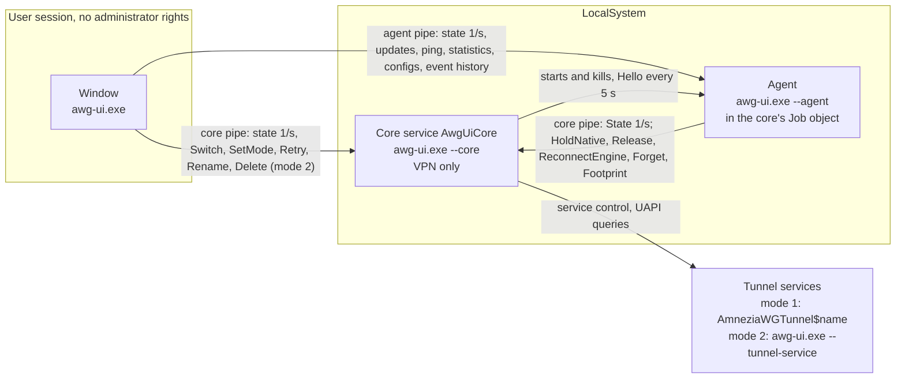

<b>English</b> | <a href="architecture.ru.md">Русский</a>

# Architecture

Related: [structure](structure.md), [modules](modules.md).

One executable, `awg-ui.exe`, runs in several roles. The command line selects the role (`src/main.rs`).

| Role | Command line | Account | Purpose |
|---|---|---|---|
| Window | none (or `--tray`, `--demo`) | the user, no administrator rights | UI only (`src/app/`, `src/monitor.rs`) |
| Core | `--core` (Windows service `AwgUiCore`) | LocalSystem | the VPN and nothing else (`src/daemon/`) |
| Agent | `--agent` | LocalSystem (child of the core) | everything that is not the VPN (`src/daemon/agent/`) |
| Tunnel service | `--tunnel-service <config>` | LocalSystem | one tunnel in mode 2 (`src/engine.rs`) |

Two short-lived helpers also exist: `--native-op <task>` (`src/daemon/helper.rs`), started by the agent in the user's session to drive the original AmneziaWG window, and `--restart-core` (`src/update/ours/fallback.rs`), used by the app self-update.

## Processes and pipes

Pipes (`src/daemon/pipe.rs`, `src/daemon/agent/mod.rs`):

1. Core pipe `\\.\pipe\AmneziaWG-UI-Dark-Core`, agent pipe `\\.\pipe\AmneziaWG-UI-Dark-Agent`.
2. Same access rules on both: SYSTEM and administrators have full control, the owner account (`owner_sid` in `core.ini`) has read and write only, remote clients are rejected. The window therefore needs no administrator rights. The pipe's owner must be SYSTEM; both sides check it.
3. Protocol: one JSON line is the request, one JSON line is the reply, then the connection closes. Types: `src/daemon/proto.rs` (core), `src/daemon/agent/proto.rs` (agent).
4. Every read and write has a deadline. The core serves at most 32 window connections at once, 8 SYSTEM connections and one slot reserved for its own startup check; the agent serves 16, 4 SYSTEM connections and one reserve slot for the watchdog `Hello`. Extra clients get a refusal, not a new thread.
5. `HoldNative`, `Release`, `ReconnectEngine`, `Forget` and `Footprint` are internal requests: the core accepts them only from SYSTEM (the agent) and refuses the window.

The window picks the pipe per request (`Routed`, `src/daemon/agent/client.rs`): tunnel configs, native-window actions, import, export and new tunnel go to the agent; everything else goes to the core. Deleting a tunnel goes to the core in mode 2 (it removes the tunnel's service) and to the agent in mode 1. The window asks the core for the mode instead of trusting its own settings.

## Who owns what

| Owner | Owns |
|---|---|
| Core | Tunnel start and stop in both modes (`src/backend.rs`, `src/engine.rs`); tunnel state via UAPI (`src/uapi.rs`); the switching lock and replacement of conflicting tunnels; the working mode; the desired set of tunnels (`core.ini`: `mode`, `tunnels`, `multiple`, `owner_sid`, `language`); the reconnect supervisor (`src/daemon/retry.rs`, `deadwatch.rs`, `restore.rs`, `netwatch.rs`); the one-second poll that builds the state and the transition events (`src/monitor.rs`); an in-memory event ring; the agent watchdog (`src/daemon/agent_watch.rs`); service install, upgrade and removal (`src/daemon/install.rs`) |
| Agent | Updates and rollbacks of the original AmneziaWG, the built-in engine and the app (`src/update/`, started from `src/daemon/agent/updates.rs`); ping (`agent.ini`); statistics (`Stats.ini`); the event log on disk (`events.log`: the only writer, rotation included); tunnel configs: the mode 2 store (`src/store.rs`: import, backup, new tunnel) and the helper for the original window in mode 1 (`src/native.rs`, `src/daemon/session.rs`) |
| Window | Presentation, `Settings.ini` next to the exe, groups and view state. It holds no VPN state: it renders what the two processes report |

Data lives in `%ProgramData%\AmneziaWG UI Dark` (SYSTEM and administrators only) and, for the mode 2 store and engine files, in `%ProgramFiles%\AmneziaWG UI Dark`.

Both processes change the mode 2 store: the core renames and deletes (under its `switching` lock), the agent writes, imports and creates tunnels. Every change runs under one store lock (`src/store.rs`: the file `tunnels\.lock` opened without sharing), held only for the file operation, waited for at most 5 s (then an error). Lock order: `switching`, then the store lock; the agent never takes `switching` and calls nobody while holding the store lock. A save of a tunnel that was renamed or deleted meanwhile fails instead of recreating it.

The core calls the agent only for the watchdog `Hello`. Calls from the agent to the core carry pipe timeouts (2 s send, 3 s reply for the state poll). The test that keeps this work out of the core is described in [modules](modules.md#enforced-fences).

### Event log

1. The core keeps the last 2000 events in memory, each with a sequence number and an instance id that changes on every core start.
2. The agent polls the core state once a second with a cursor and appends core events, together with its own, to `events.log` (rotation at 1 MiB). The mark written next to each event lets a restarted agent continue without repeats and lets it detect a restarted core. On service stop the core hands over to the service the events the agent has not taken (its last confirmed cursor); a cursor beyond the core's last event (a mark of a previous core instance) is not taken as a confirmation, so the tail is not lost.
3. The core writes to the file itself only where there is no agent to hand over to: errors before the pipe is up, the panic hook, and the not yet collected tail when the service stops.
4. The window shows live core events from the core state, and history plus agent events from the agent (`Events` request).
5. The window panel (`src/app/event_log.rs`) filters what it holds by severity (all, warnings and errors, errors) and by the tunnel selected in the list, and searches tunnel names and texts without regard to case. Right click on a line: "Copy" and "Copy all visible"; "Save as…" writes the visible lines to a file chosen in the standard Windows dialog. Copied and saved lines have the `events.log` format (`YYYY.MM.DD HH:MM:SS`, severity, tunnel, text, tab-separated).

### Updates that touch tunnels

1. Original AmneziaWG: the MSI removes tunnel services. The agent sends `HoldNative {lease_s}` (15 min lease, the core caps it at 1 h); the core picks the mode 1 tunnels itself (running and desired; the agent has no tunnel state), stops supervising them, marks them busy and answers `Held` with the list. After the MSI the agent sends `Release` for that list, and the core reconnects the desired tunnels that are not running. If the agent dies, the lease expires and supervision resumes by itself. If the core is unreachable or refuses the lease, the MSI is not started.
2. Built-in engine: the agent replaces the DLLs and sends `ReconnectEngine`; the core reconnects mode 2 tunnels in its supervisor thread. The request is persisted before the files are replaced (`updates\after_change.json`) and cleared only when the core accepted it: if the agent dies before sending it or the core does not answer, the agent re-sends it on its next scheduler tick. A repeated request before the supervisor tick reconnects once.
3. The app itself: the agent installs the new file set and starts `awg-ui.exe --restart-core` outside the core's job (`CREATE_BREAKAWAY_FROM_JOB`, which the job allows). The helper restarts the core service; if the new core does not come up, it rolls the whole set back (`src/update/ours/fallback.rs`). The agent dies with the old core, and the new core starts a new one.

## Working modes

The core owns the mode (`mode` in `core.ini`). It is switched at runtime without restarting the window (`SetMode`: tunnels of the old mode are disconnected, the desired set is cleared).

| | Mode 1: installed AmneziaWG | Mode 2: built-in engine |
|---|---|---|
| Tunnel | service `AmneziaWGTunnel$<name>`, created by the original `amneziawg.exe /installtunnelservice` and removed by `/uninstalltunnelservice` | service named after the tunnel, running `awg-ui.exe --tunnel-service <config>`, which loads `tunnel.dll` and `wintun.dll` |
| Config storage | the original's own encrypted store; this program never decrypts it and edits configs only through the original window (helper in the user's session, UI Automation) | `%ProgramFiles%\AmneziaWG UI Dark\tunnels\<name>.conf.dpapi`, DPAPI machine scope, folder open to SYSTEM and administrators only |
| Core prepares | ensures the service `AmneziaWGManager` is running | initializes the store; clears the services' own restart-on-failure actions (the supervisor is the only reconnector) |
| Config requests | agent: `Native`, `Read`, `Write`, `Details`, `Delete` | agent: `Import`, `ExportAll`, `NewTunnel`, `TakeNative`, `Read`, `Write`, `Details`; the core deletes and renames (they touch the service) |
| Engine files | not used | copied to `%ProgramFiles%` and checked against SHA-256 values pinned at build time or in the signed manifest (`src/engine.rs`) |
| Window cue | default colors | yellow icon and frames |

In both modes the tunnel is a separate Windows service, outside the core process. Its state is read through the tunnel's UAPI pipe.

## When something fails

| Event | VPN | Effect | Recovery |
|---|---|---|---|
| Agent exits or crashes | untouched | the running update job, ping history (in memory) and an in-flight helper action are lost; an interrupted native (MSI) rollback is marked "interrupted" in the history at the next agent start; the window shows "secondary service unavailable" for agent actions and ping | the watchdog restarts it after 1, 2, 4 ... 60 s; a run longer than 5 min resets the series; retries never stop. The core state shows `agent: Down` |
| Agent hangs | untouched | same, and window calls to the agent time out (2 s send, 5 s reply) | `Hello` every 5 s with a 5 s timeout; after the agent has answered once, 3 misses in a row (about 30 s) make the watchdog terminate and restart it; a new agent has a 60 s start grace (no miss while its pipe is not open yet), and one that never answers within it is terminated and logged as "did not start" |
| Agent leaks memory | untouched | none outside the agent | the Job object caps the process at 512 MiB; the leak becomes a crash and a restart |
| Agent crash-loops after an update | untouched | updates, ping and statistics unavailable | restarts every 60 s without end; the first 5 exits and every 60th after are logged; there is no automatic rollback (it would restart the core). The owner reinstalls or rolls back |
| Agent dies in the middle of an MSI | tunnels under `HoldNative` are not supervised | `msiexec` is not killed | the lease expires (15 min) and supervision reconnects the desired set |
| Agent dies after replacing the engine DLLs, before `ReconnectEngine` | mode 2 tunnels keep running on the old DLL | `updates\after_change.json` keeps the owed request | the new agent re-sends `ReconnectEngine` on its first scheduler tick |
| Core stops or crashes | tunnel services keep passing traffic; reconnecting dropped tunnels pauses | the agent is killed with the job (`KILL_ON_JOB_CLOSE`); the window shows "no connection to the core" after 2 failed polls | the service manager restarts the core after 5 s (restart on every failure); the first supervisor tick restores the desired set; once the pipe answers, the core starts a new agent |
| Panic in an essential core thread | as above | the core stops with a failure code | same restart |
| Panic while handling one request | untouched | that request gets an error reply | none needed |
| Panic in a secondary core thread (agent watchdog) | untouched | logged | the step repeats after a pause |
| Window closes or crashes | untouched | none | start the window again; exit asks whether to keep the VPN running |

Not covered: the code has no watchdog for a core that hangs without exiting. The window only shows that the core does not answer.

Reconnect schedule of the supervisor (`src/daemon/retry.rs`): every 10 s for the first 3 minutes, every minute until 10 minutes, then every 10 minutes without end. A network change triggers an attempt at once (not more often than every 3 s).
