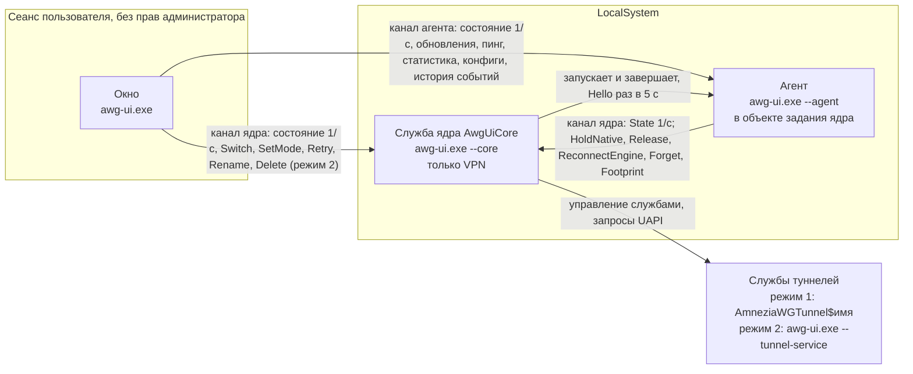

<a href="architecture.md">English</a> | <b>Русский</b>

# Архитектура

См. также: [структура](structure.ru.md), [модули](modules.ru.md).

Один исполняемый файл `awg-ui.exe` работает в нескольких ролях. Роль выбирает командная строка (`src/main.rs`).

| Роль | Командная строка | Учётная запись | Назначение |
|---|---|---|---|
| Окно | без ключей (или `--tray`, `--demo`) | пользователь, без прав администратора | только интерфейс (`src/app/`, `src/monitor.rs`) |
| Ядро | `--core` (служба Windows `AwgUiCore`) | LocalSystem | только VPN (`src/daemon/`) |
| Агент | `--agent` | LocalSystem (дочерний процесс ядра) | всё, что не VPN (`src/daemon/agent/`) |
| Служба туннеля | `--tunnel-service <конфиг>` | LocalSystem | один туннель в режиме 2 (`src/engine.rs`) |

Есть ещё два коротких помощника: `--native-op <задание>` (`src/daemon/helper.rs`) агент запускает в сеансе пользователя для управления родным окном AmneziaWG, `--restart-core` (`src/update/ours/fallback.rs`) нужен самообновлению программы.

## Процессы и каналы

Каналы (`src/daemon/pipe.rs`, `src/daemon/agent/mod.rs`):

1. Канал ядра `\\.\pipe\AmneziaWG-UI-Dark-Core`, канал агента `\\.\pipe\AmneziaWG-UI-Dark-Agent`.
2. Права на обоих одинаковы: SYSTEM и администраторы — полный доступ, учётная запись владельца (`owner_sid` в `core.ini`) — только чтение и запись, удалённые клиенты отклоняются. Поэтому окну не нужны права администратора. Владелец канала обязан быть SYSTEM; проверяют обе стороны.
3. Протокол: одна строка JSON — запрос, одна строка JSON — ответ, затем соединение закрывается. Типы: `src/daemon/proto.rs` (ядро), `src/daemon/agent/proto.rs` (агент).
4. У каждого чтения и записи есть срок. Ядро обслуживает не более 32 соединений окна одновременно, 8 соединений SYSTEM и один запасной слот для собственной проверки при запуске; агент — 16, 4 соединения SYSTEM и один запасной слот для `Hello` сторожа. Лишние клиенты получают отказ, а не новый поток.
5. `HoldNative`, `Release`, `ReconnectEngine`, `Forget` и `Footprint` — внутренние запросы: ядро принимает их только от SYSTEM (агента), окну отвечает отказом.

Канал выбирается по запросу (`Routed`, `src/daemon/agent/client.rs`): конфиги туннелей, действия в родном окне, импорт, экспорт и новый туннель идут к агенту, остальное — к ядру. Удаление туннеля в режиме 2 идёт к ядру (оно убирает службу туннеля), в режиме 1 — к агенту. Режим окно спрашивает у ядра, а не берёт из своих настроек.

## Кто чем владеет

| Владелец | Владеет |
|---|---|
| Ядро | Подключение и отключение туннелей обоих режимов (`src/backend.rs`, `src/engine.rs`); состояние туннелей через UAPI (`src/uapi.rs`); блокировка переключения и замена конфликтующих туннелей; режим работы; желаемый набор туннелей (`core.ini`: `mode`, `tunnels`, `multiple`, `owner_sid`, `language`); надзор за переподключением (`src/daemon/retry.rs`, `deadwatch.rs`, `restore.rs`, `netwatch.rs`); опрос раз в секунду, из которого строятся состояние и события перехода (`src/monitor.rs`); журнал событий в памяти; сторож агента (`src/daemon/agent_watch.rs`); установка, обновление и удаление службы (`src/daemon/install.rs`) |
| Агент | Обновления и откаты оригинального AmneziaWG, встроенного движка и программы (`src/update/`, запуск из `src/daemon/agent/updates.rs`); язык своих текстов (`language` ядра из `core.ini`, только чтение, `src/daemon/agent/language.rs`); пинг (`agent.ini`); статистика (`Stats.ini`); журнал событий на диске (`events.log`: единственный писатель, включая ротацию); конфиги туннелей: хранилище режима 2 (`src/store.rs`: импорт, резервная копия, новый туннель) и помощник родного окна в режиме 1 (`src/native.rs`, `src/daemon/session.rs`) |
| Окно | Показ, `Settings.ini` рядом с exe, группы и состояние вида. Состояния VPN у окна нет: оно показывает то, что сообщают два процесса |

Данные лежат в `%ProgramData%\AmneziaWG UI Dark` (только SYSTEM и администраторы), а хранилище режима 2 и файлы движка — в `%ProgramFiles%\AmneziaWG UI Dark`.

Хранилище режима 2 меняют оба процесса: ядро переименовывает и удаляет (под своей блокировкой `switching`), агент записывает, импортирует и создаёт туннели. Каждое изменение идёт под одним замком хранилища (`src/store.rs`: файл `tunnels\.lock`, открытый без совместного доступа), который держится только на время файловой операции; ожидание — не дольше 5 с, затем ошибка. Порядок замков: `switching`, затем замок хранилища; агент `switching` не берёт и под замком хранилища ни к кому не обращается. Сохранение туннеля, который тем временем переименовали или удалили, завершается ошибкой, а не создаёт его заново.

Ядро обращается к агенту только с `Hello` сторожа. У вызовов агента к ядру есть сроки канала (для опроса состояния — 2 с на отправку, 3 с на ответ). Тест, не пускающий эту работу в ядро, описан в [модулях](modules.ru.md#ограды-проверяемые-тестами).

### Журнал событий

1. Ядро держит последние 2000 событий в памяти, у каждого — порядковый номер и код экземпляра, который меняется при каждом запуске ядра.
2. Агент раз в секунду опрашивает состояние ядра с курсором и дописывает события ядра вместе со своими в `events.log` (ротация при 1 МиБ). Метка рядом с событием позволяет перезапущенному агенту продолжить без повторов и заметить перезапуск ядра. При остановке службы ядро отдаёт ей события, которых агент не забрал (последний подтверждённый курсор); курсор дальше последнего события ядра (метка прежнего экземпляра ядра) подтверждением не считается, поэтому хвост не теряется.
3. Сами в файл ядро пишет только там, где передать некому: ошибки до запуска канала, обработчик паники и ещё не забранный хвост при остановке службы.
4. Окно показывает живые события ядра из его состояния, а историю и события агента — из ответов агента (запрос `Events`).
5. Панель окна (`src/app/event_log.rs`) отбирает то, что у неё есть, по важности (все, предупреждения и ошибки, только ошибки) и по туннелю, выбранному в списке, и ищет по имени туннеля и тексту без учёта регистра. Правая кнопка на строке: «Копировать» и «Копировать все видимые»; «Сохранить как…» пишет видимые строки в файл, выбранный в стандартном диалоге Windows. Скопированные и сохранённые строки — в формате `events.log` (`ГГГГ.ММ.ДД ЧЧ:ММ:СС`, важность, туннель, текст через табуляцию).

### Обновления, затрагивающие туннели

1. Оригинальный AmneziaWG: MSI убирает службы туннелей. Агент шлёт `HoldNative {lease_s}` (аренда 15 мин, ядро ограничивает её часом); ядро само выбирает туннели режима 1 (работающие и желаемые; своих сведений о туннелях у агента нет), снимает их с надзора, помечает занятыми и отвечает `Held` со списком. После MSI агент шлёт `Release` с этим списком, и ядро подключает желаемые туннели, которые не работают. Если агент пропал, аренда истекает и надзор возобновляется сам. Если ядро недоступно или аренду не дало, MSI не запускается.
2. Встроенный движок: агент заменяет DLL и шлёт `ReconnectEngine`; ядро переподключает туннели режима 2 в потоке надзора. Запрос сохраняется до замены файлов (`updates\after_change.json`) и снимается только после того, как ядро его приняло: если агент погиб до отправки или ядро не ответило, агент повторяет запрос на ближайшем такте планировщика. Повтор до такта надзора переподключает один раз.
3. Сама программа: агент ставит новый набор файлов и запускает `awg-ui.exe --restart-core` вне задания ядра (`CREATE_BREAKAWAY_FROM_JOB`, задание это разрешает). Помощник перезапускает службу ядра; если новое ядро не поднялось, он возвращает весь набор (`src/update/ours/fallback.rs`). Агент погибает вместе со старым ядром, новое ядро запускает нового.

## Режимы работы

Режимом владеет ядро (`mode` в `core.ini`). Он переключается на лету, без перезапуска окна (`SetMode`: туннели прежнего режима отключаются, желаемый набор очищается).

| | Режим 1: установленный AmneziaWG | Режим 2: встроенный движок |
|---|---|---|
| Туннель | служба `AmneziaWGTunnel$<имя>`; создаётся оригинальным `amneziawg.exe /installtunnelservice`, удаляется `/uninstalltunnelservice` | служба с именем туннеля, запускающая `awg-ui.exe --tunnel-service <конфиг>`; она загружает `tunnel.dll` и `wintun.dll` |
| Хранение конфигов | собственное зашифрованное хранилище оригинала; программа его не расшифровывает и правит конфиги только через родное окно (помощник в сеансе пользователя, запускается вне задания ядра с `CREATE_BREAKAWAY_FROM_JOB` - задание не может держать процессы двух сеансов; UI Automation) | `%ProgramFiles%\AmneziaWG UI Dark\tunnels\<имя>.conf.dpapi`, DPAPI области компьютера, папка открыта только SYSTEM и администраторам |
| Ядро готовит | следит, чтобы служба `AmneziaWGManager` работала | инициализирует хранилище; снимает собственные действия служб при сбое (переподключает только надзор) |
| Запросы к конфигам | агент: `Native`, `Read`, `Write`, `Details`, `Delete` | агент: `Import`, `ExportAll`, `NewTunnel`, `TakeNative`, `Read`, `Write`, `Details`; удаление и переименование делает ядро (они трогают службу) |
| Файлы движка | не используются | копируются в `%ProgramFiles%` и проверяются по SHA-256, вшитым при сборке или взятым из подписанного манифеста (`src/engine.rs`) |
| Признак в окне | цвета темы | жёлтые иконки; рамки, разделители и рамка окна Windows 11 цвета режима 2 из темы |

В обоих режимах туннель — отдельная служба Windows вне процесса ядра. Его состояние читается через канал UAPI туннеля.

Цвет признака режима 2 зависит от темы (`mode2_frame` в `src/app/theme.rs`): FFD60A у Графита и Сланца, B07D00 у Дня. `apply_look` в `src/app/core_ui.rs` выставляет признак, палитру egui и заголовок окна Windows (тёмный или светлый, `src/win.rs`) при каждой смене режима или темы. winit на любую смену системных настроек молча ставит заголовку тему Windows, поэтому `apply_look` ещё и заново отмечает заголовок (только атрибут DWM), когда окно получает или теряет фокус. В режиме 1 рамка окна остаётся системной.

## Если что-то отказало

| Событие | VPN | Последствия | Восстановление |
|---|---|---|---|
| Агент вышел или упал | не затронут | теряются идущая работа обновления, история пинга (в памяти) и действие помощника в пути; оборванный возврат AmneziaWG (MSI) в истории помечается «прервано» при следующем запуске агента; окно пишет «вторичная служба недоступна» для действий агента и пинга | сторож запускает его через 1, 2, 4 ... 60 с; работа дольше 5 мин сбрасывает серию; попытки не прекращаются. В состоянии ядра — `agent: Down` |
| Агент завис | не затронут | то же, и вызовы окна к агенту истекают по сроку (2 с отправка, 5 с ответ) | `Hello` раз в 5 с со сроком 5 с; после первого ответа 3 промаха подряд (около 30 с) — сторож завершает процесс и запускает заново; у нового агента 60 с на запуск (пока канал не открыт, промаха нет), не ответивший за это время завершается и пишется в журнал как «не запустился» |
| Утечка памяти агента | не затронут | вне агента ничего | объект задания ограничивает процесс 512 МиБ; утечка становится падением и перезапуском |
| Агент падает при каждом запуске после обновления | не затронут | обновления, пинг и статистика недоступны | перезапуск раз в 60 с бессрочно; в журнал идут первые 5 выходов и каждый 60-й дальше; автоматического отката нет (он перезапустил бы ядро). Владелец переустанавливает или откатывает |
| Агент погиб посреди MSI | туннели под `HoldNative` не под надзором | `msiexec` не завершается | аренда истекает (15 мин), надзор подключает желаемый набор |
| Агент погиб после замены DLL движка, до `ReconnectEngine` | туннели режима 2 работают на старой DLL | `updates\after_change.json` хранит невыполненный запрос | новый агент повторяет `ReconnectEngine` на первом такте планировщика |
| Ядро остановилось или упало | службы туннелей продолжают передавать трафик; переподключение упавших туннелей приостановлено | агент завершается вместе с заданием (`KILL_ON_JOB_CLOSE`); окно после 2 неудачных опросов пишет «нет связи с ядром» | диспетчер служб перезапускает ядро через 5 с (перезапуск при каждом сбое); первый такт надзора восстанавливает желаемый набор; когда канал отвечает, ядро запускает нового агента |
| Паника в важном потоке ядра | как выше | ядро останавливается с кодом сбоя | тот же перезапуск |
| Паника при обработке одного запроса | не затронут | запрос получает ответ с ошибкой | не требуется |
| Паника во вторичном потоке ядра (сторож агента) | не затронут | запись в журнал | шаг повторяется после паузы |
| Окно закрыто или упало | не затронут | нет | запустить окно снова; при выходе спрашивают, оставить ли VPN работать |

Паника потока, держащего замок, не делает замок недоступным для остальных потоков: общее состояние запирается через `crash::lock`, `crash::read` и `crash::write` (`src/crash.rs`) — они пишут в журнал ядра одно событие «lock recovered» и снимают отравление. Тест в `src/crash.rs` запрещает `.lock().unwrap()` и его варианты для `RwLock` вне тестового кода.

Не покрыто: у зависшего, но не вышедшего ядра в коде сторожа нет. Окно лишь показывает, что ядро не отвечает.

Расписание переподключения надзора (`src/daemon/retry.rs`): первые 3 минуты каждые 10 с, до 10 минут — раз в минуту, дальше раз в 10 минут бессрочно. Смена сети — попытка сразу (не чаще чем раз в 3 с).
