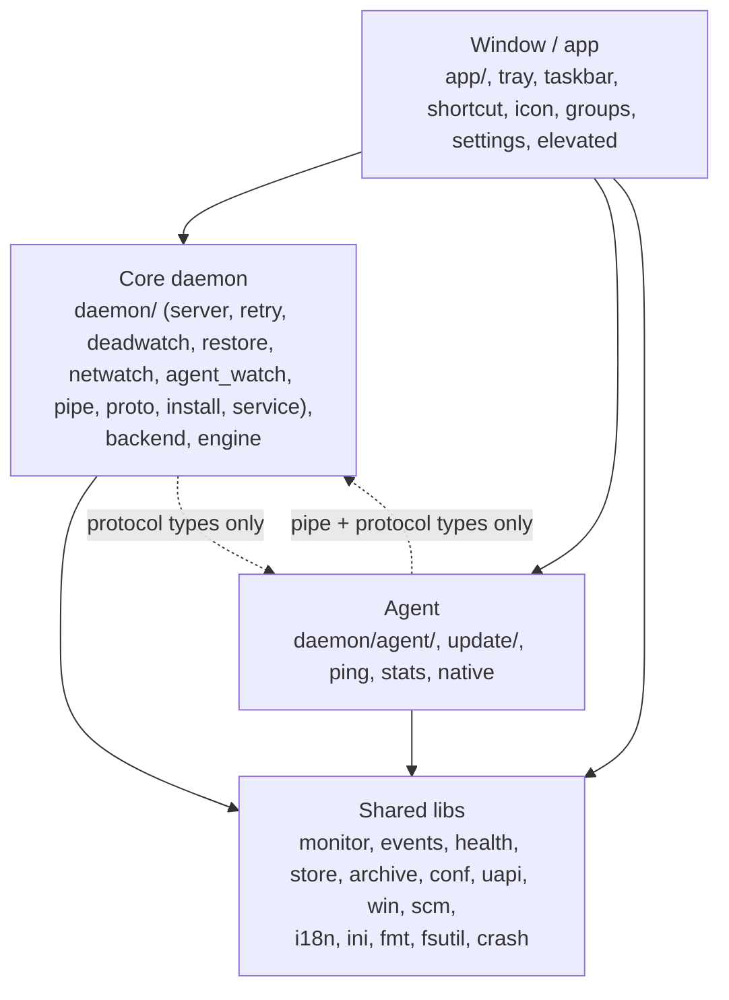
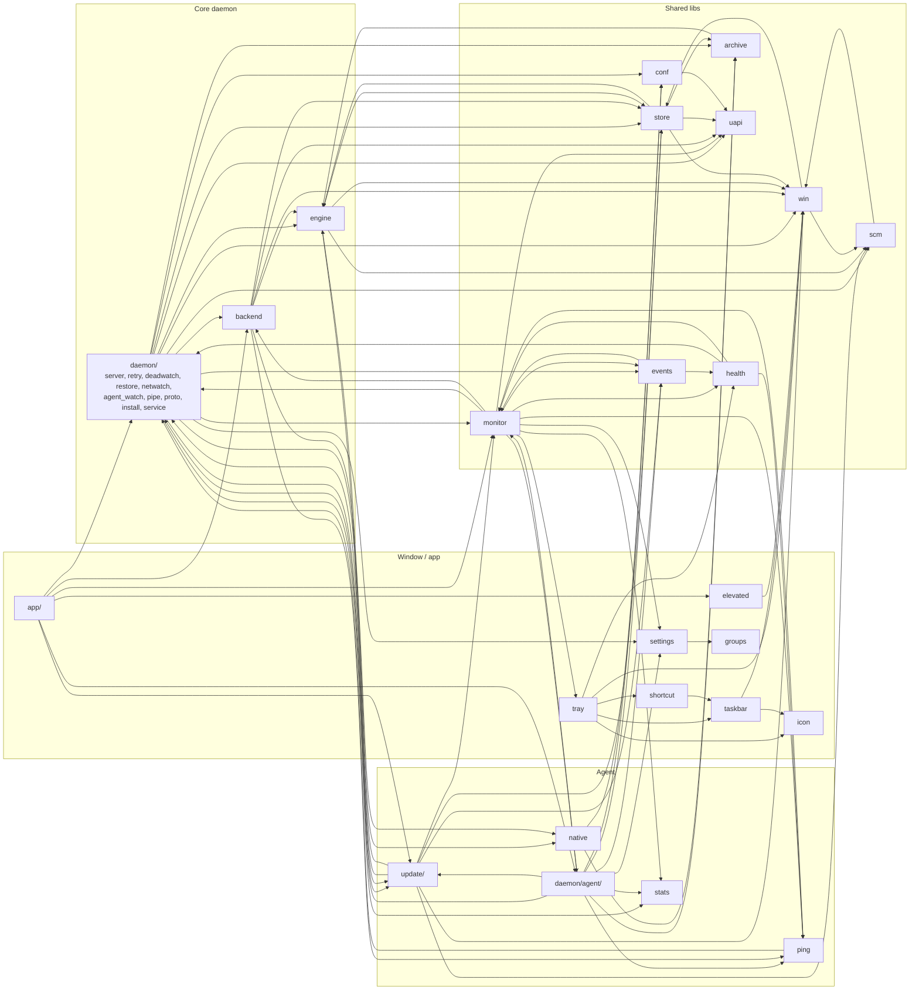

<b>English</b> | <a href="modules.ru.md">Русский</a>

# Module dependencies

Related: [architecture](architecture.md), [structure](structure.md).

The graphs are derived from `crate::...` paths in the code of `src/` (test code and comments excluded). An arrow `A --> B` means A mentions B.

## Layers

1. The window talks to both processes through their protocol types and clients (`daemon::CoreApi`, `daemon::agent::client`).
2. The agent depends on the core only for the pipe client, the protocol (`daemon::proto`), `Config` and the data folder path, plus `daemon::helper` for the user-session helper.
3. The core mentions the agent's area in its protocol types (`Request::Updates`, `CoreState.stats`, `CoreState.ping`, kept for older windows), in `daemon/install.rs` (update checks during install) and in `daemon/helper.rs` (the helper process uses `native`). The scanned core files do not (see below).

## Modules

Edges to `i18n`, `ini`, `fmt`, `fsutil` and `crash` (used almost everywhere) are omitted. From `app` only the main edges are drawn; it also mentions `engine`, `events`, `stats`, `ping`, `tray`, `health`, `conf`, `uapi`, `win` and others directly.

Notes on the graph:

1. `dcore` stands for the core files of `src/daemon/` (everything except `agent/`). The `dcore --> native`, `dcore --> update` and `dcore --> stats` edges come from `daemon/helper.rs`, `daemon/install.rs` and `daemon/proto.rs`, which the core fence does not scan.
2. `monitor --> dagent` is the `AgentApi` trait the window uses to mirror the agent. `ping --> dcore` and `health --> dcore` use protocol types (`PingDto`, `daemon::proto`).
3. `engine --> update` is `update::sign` and `update::ours`: hash checks of the engine files against the signed manifest.
4. The graph has cycles at module level: `events` and `monitor`, `engine` and `store`, `engine` and `update`, `win` and `scm`, `dcore` and `update`. The layer rules below are about the core's live code path, not about an acyclic module graph.

## Enforced fences

Two tests scan source text (code only, without `#[cfg(test)]` blocks and `//` comment lines) and fail the build on a violation.

1. `core_does_not_reach_into_agent_work`, in `src/daemon/mod.rs`. The core must not depend on the update, ping, statistics or native-helper code, and must not write the event file on live paths.
   1.1. Scanned: `daemon/server.rs`, `retry.rs`, `deadwatch.rs`, `restore.rs`, `agent_watch.rs`, `netwatch.rs`, `service.rs`, and the functions `spawn`, `poll` and `core_state` of `src/monitor.rs`.
   1.2. Forbidden words: `crate::update`, `update::`, `crate::ping`, `ping::`, `crate::stats`, `stats::`, `TunnelStats`, `crate::native`, `native::`, `helper::`, `run_elevated`.
   1.3. Forbidden on live paths too (every scanned file except `service.rs`): `append_event`, `EventLog::open`, `events_file`. `service.rs` may touch the file, because it runs after the core stopped.
   1.4. Not scanned: `daemon/proto.rs` (its types are shared with older windows), `install.rs`, `helper.rs`, and the tunnel code of `backend.rs` and `engine.rs`. The fence is a text check, not a dependency analysis.
   1.5. `core_fence_sees_code_not_comments_or_tests` checks the checker itself.
2. `agent_does_not_reach_into_vpn_code`, in `src/daemon/agent/mod.rs`. The agent must not contain VPN code: forbidden are `daemon::server`, `daemon::retry`, `daemon::deadwatch`, `daemon::restore`, `daemon::netwatch`, `crate::backend`, `crate::engine`, `crate::uapi` and `switching`, in all files of `src/daemon/agent/`.

Behavioral isolation tests in `src/daemon/server.rs`: `isolation_killed_agent_is_respawned_and_the_core_keeps_working` and `isolation_hung_agent_is_killed_and_respawned_without_slowing_the_core`. Waits for the fake agent process to start use a generous budget (`START_BUDGET`, 30 s: the first start of a freshly built exe can be slowed by antivirus scanning); the core checks stay strict (every Switch answered within 1 s, tunnel reconnected on the supervisor schedule). The core under these tests keeps its desired set in memory (`config_file: None`): the durable `core.ini` write flushes the disk twice and under disk load alone takes over 1 s, so the 1 s bound measures the core, not the disk. `isolation_slow_agent_start_is_waited_for_not_taken_for_a_hang` checks the harness itself with an agent that opens its pipe 4 s after start.

A third fence is unrelated to the process split: `windows_follow_the_standard` in `src/app/dialog.rs` forbids creating `egui::Window` anywhere except the shared dialog constructor.

A fourth: `context_menus_go_through_the_helper` in `src/app/menu.rs` forbids a raw right-click menu in `src/app` (`Popup::context_menu`, `Response::context_menu`, `secondary_clicked`); every context menu goes through `menu::context_menu`, which also opens it on Shift+F10 and the Menu key.
