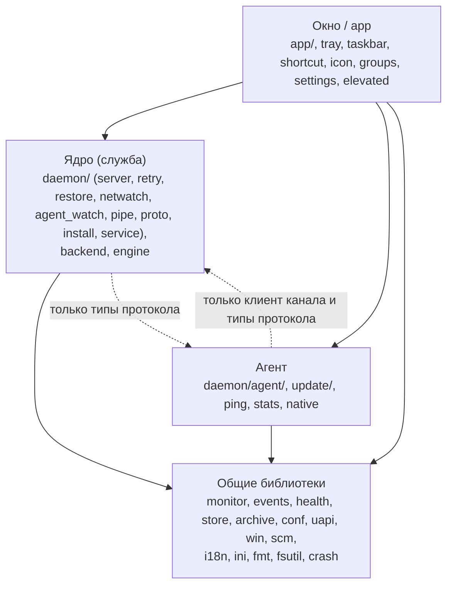
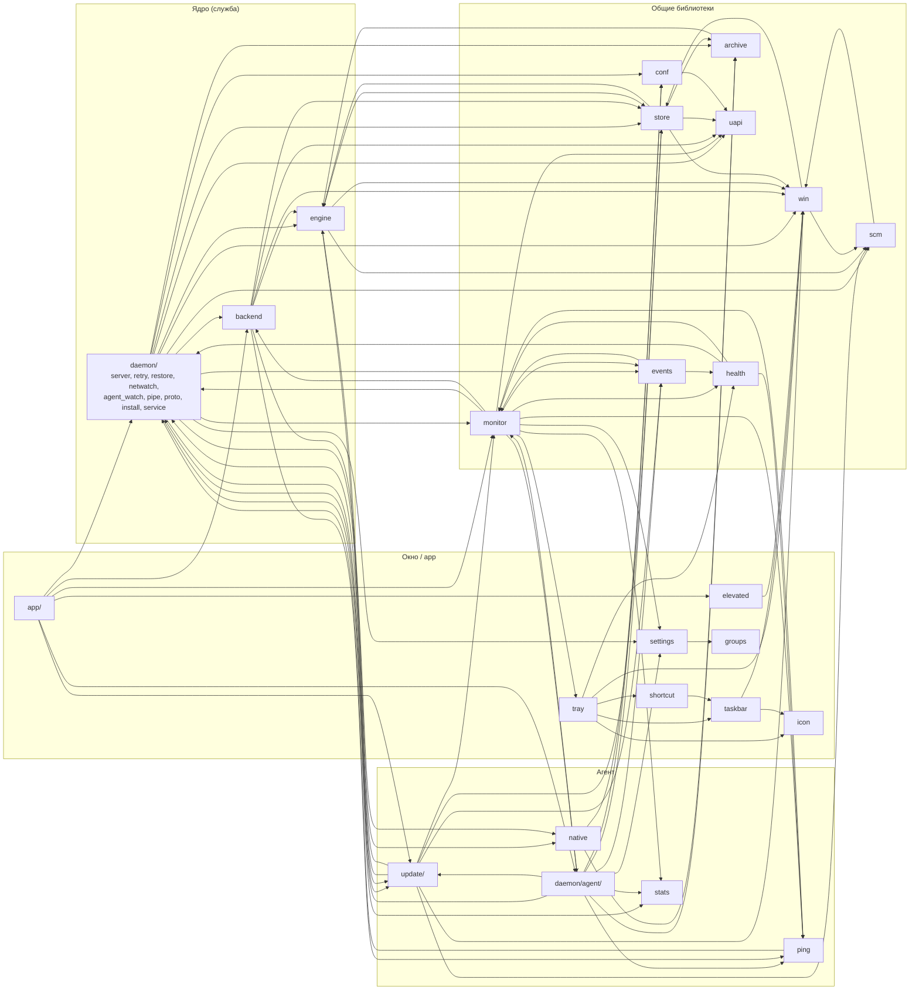

<a href="modules.md">English</a> | <b>Русский</b>

# Зависимости модулей

См. также: [архитектура](architecture.ru.md), [структура](structure.ru.md).

Графы построены по путям `crate::...` в коде `src/` (без тестов и комментариев). Стрелка `A --> B` значит: A упоминает B.

## Слои

1. Окно говорит с обоими процессами через их типы протокола и клиенты (`daemon::CoreApi`, `daemon::agent::client`).
2. Агент зависит от ядра только клиентом канала, протоколом (`daemon::proto`), `Config` и путём к папке данных, а также `daemon::helper` для помощника в сеансе пользователя.
3. Ядро упоминает область агента в типах протокола (`Request::Updates`, `CoreState.stats`, `CoreState.ping`, оставлены для окон прежних версий), в `daemon/install.rs` (проверки обновлений при установке) и в `daemon/helper.rs` (процесс помощника использует `native`). Проверяемые файлы ядра — нет (см. ниже).

## Модули

Рёбра к `i18n`, `ini`, `fmt`, `fsutil` и `crash` (их используют почти все) не показаны. От `app` нарисованы только главные рёбра; она также напрямую упоминает `engine`, `events`, `stats`, `ping`, `tray`, `health`, `conf`, `uapi`, `win` и другие.

Примечания к графу:

1. `dcore` — файлы ядра в `src/daemon/` (всё, кроме `agent/`). Рёбра `dcore --> native`, `dcore --> update` и `dcore --> stats` идут из `daemon/helper.rs`, `daemon/install.rs` и `daemon/proto.rs`, которые ограда ядра не проверяет.
2. `monitor --> dagent` — трейт `AgentApi`, через который окно отражает состояние агента. `ping --> dcore` и `health --> dcore` — типы протокола (`PingDto`, `daemon::proto`).
3. `engine --> update` — `update::sign` и `update::ours`: проверка хешей файлов движка по подписанному манифесту.
4. На уровне модулей в графе есть циклы: `events` и `monitor`, `engine` и `store`, `engine` и `update`, `win` и `scm`, `dcore` и `update`. Правила слоёв ниже — про живой путь кода ядра, а не про ацикличный граф модулей.

## Ограды, проверяемые тестами

Два теста просматривают текст исходников (только код, без блоков `#[cfg(test)]` и строк-комментариев `//`) и роняют сборку при нарушении.

1. `core_does_not_reach_into_agent_work` в `src/daemon/mod.rs`. Ядро не должно зависеть от кода обновлений, пинга, статистики и помощника родного окна и не должно писать файл журнала на живых путях.
   1.1. Проверяются: `daemon/server.rs`, `retry.rs`, `restore.rs`, `agent_watch.rs`, `netwatch.rs`, `service.rs` и функции `spawn`, `poll`, `core_state` из `src/monitor.rs`.
   1.2. Запрещённые слова: `crate::update`, `update::`, `crate::ping`, `ping::`, `crate::stats`, `stats::`, `TunnelStats`, `crate::native`, `native::`, `helper::`, `run_elevated`.
   1.3. На живых путях запрещено ещё (во всех проверяемых файлах, кроме `service.rs`): `append_event`, `EventLog::open`, `events_file`. `service.rs` может трогать файл: он работает после остановки ядра.
   1.4. Не проверяются: `daemon/proto.rs` (его типы общие с окнами прежних версий), `install.rs`, `helper.rs`, а также код туннелей в `backend.rs` и `engine.rs`. Ограда — проверка текста, а не анализ зависимостей.
   1.5. `core_fence_sees_code_not_comments_or_tests` проверяет саму проверку.
2. `agent_does_not_reach_into_vpn_code` в `src/daemon/agent/mod.rs`. В агенте не должно быть кода VPN: во всех файлах `src/daemon/agent/` запрещены `daemon::server`, `daemon::retry`, `daemon::restore`, `daemon::netwatch`, `crate::backend`, `crate::engine`, `crate::uapi` и `switching`.

Проверки изоляции в `src/daemon/server.rs`: `isolation_killed_agent_is_respawned_and_the_core_keeps_working` и `isolation_hung_agent_is_killed_and_respawned_without_slowing_the_core`. Запуск процесса поддельного агента ждётся с запасом (`START_BUDGET`, 30 с: первый запуск только что собранного exe может тормозить проверка антивирусом); проверки ядра остаются строгими (каждый Switch — быстрее 1 с, туннель поднят по расписанию надзора). Ядро в этих тестах держит желаемый набор в памяти (`config_file: None`): надёжная запись `core.ini` дважды сбрасывает диск и под нагрузкой на диск одна занимает больше 1 с, так что срок 1 с мерит ядро, а не диск. `isolation_slow_agent_start_is_waited_for_not_taken_for_a_hang` проверяет саму обвязку агентом, который открывает канал через 4 с после запуска.

Третья ограда к разделению процессов не относится: `windows_follow_the_standard` в `src/app/dialog.rs` запрещает создавать `egui::Window` где-либо, кроме общего конструктора диалогов.

Четвёртая: `context_menus_go_through_the_helper` в `src/app/menu.rs` запрещает в `src/app` контекстное меню по правому щелчку напрямую (`Popup::context_menu`, `Response::context_menu`, `secondary_clicked`); любое контекстное меню строится через `menu::context_menu`, которое открывает его ещё и по Shift+F10 и клавише меню.
