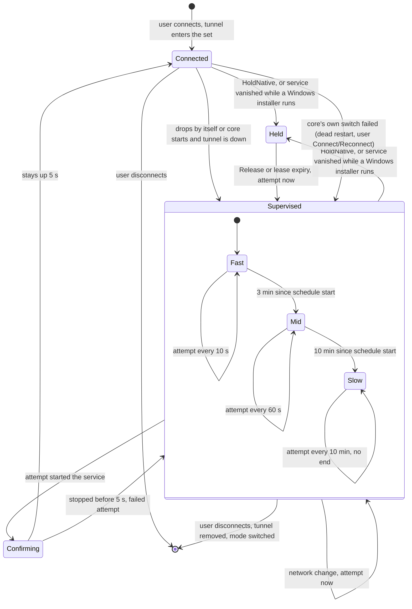

<b>English</b> | <a href="supervisor.ru.md">Русский</a>

# Supervisor: how tunnels are kept up

The supervisor is a thread of the core service (`retry`, started in `serve_until_stopped` of `src/daemon/server.rs`). It is the only owner of
reconnects: it brings back every tunnel the user left connected, after a reboot, a power loss, a core restart or a drop. Decisions are pure
code in `src/daemon/retry.rs` (time is a parameter, so the schedule is tested without clocks or services); `Core::supervise_tick` in
`src/daemon/server.rs` applies them with the ordinary switch.

## Desired set

1. The set of tunnels the user wants connected is the `tunnels` key of `[core]` in `core.ini` (`C:\ProgramData\AmneziaWG UI Dark\core.ini`), a
   comma-separated list; `multiple` stores the "several tunnels at once" choice of the last connect (`src/daemon/mod.rs`, `Config`).
2. It changes only by commands of the user (`src/daemon/restore.rs`, `after_switch`):
   1. `Switch` with `Connect` adds the tunnel; the tunnels it replaced leave the set.
   2. `Switch` with `Disconnect` removes it; `Reconnect` keeps it.
   3. `SetMode` empties the set (the tunnels of the previous mode were disconnected on purpose).
   4. Deleting or renaming a tunnel removes or renames its entry.
3. It does **not** change when a tunnel drops by itself or when Windows shuts down: that is exactly the case the set exists for.
4. Names are filtered by the tunnel name rule when the file is read. A failed save (an antivirus or backup agent holding `core.ini`) is logged
   as a warning once; the new set stays valid in memory and the supervisor retries the write on its ticks with a growing pause (1 s, 2 s, ... up to
   60 s) until it succeeds, then logs one line that it is saved. Every retry writes the current settings, so an older snapshot never overwrites a
   newer one. The write runs outside the core's settings lock (`Core::saving` serialises writers; the lock is held only to take the snapshot), so the
   1 s `State` polls of the window and the agent do not wait for the disk.
5. `core.ini` of an older version has no `tunnels` key: the set is unknown. After `ADOPT_AFTER` (30 s, so the tunnel services have time to come
   up) the running tunnels become the set (`multiple` is true if more than one runs) and the supervisor starts its first tick. An explicitly empty key
   stays empty.

## Schedule

A tunnel in the set that is not running gets a track (`Track`) with its own schedule. The supervisor ticks every 1 s (`TICK`). Exact numbers:

| Constant | Value | Meaning |
|---|---|---|
| `FAST_EVERY` | 10 s | pause between attempts in the first phase |
| `FAST_FOR` | 3 min | first phase lasts until this much time has passed since the schedule began |
| `MID_EVERY` | 60 s | pause in the second phase |
| `SLOW_FROM` | 10 min | the third phase begins |
| `SLOW_EVERY` | 10 min | pause in the third phase, without end (the owner may be far from the machine) |
| `NETWORK_MIN_GAP` | 3 s | an extra attempt on a network change comes no sooner than this after the previous one |
| `CONFIRM_FOR` | 5 s | a tunnel must stay up this long to count as connected |
| `MAX_LEASE` | 60 min | the longest a single lease takes a tunnel off supervision |
| `AFTER_LEASE` | 30 min | after a lease expired by itself, a vanished mode 1 service still means "reconnect", not "removed in the AmneziaWG window" |
| `INSTALLER_GRACE` | 15 s | implicit lease of a mode 1 tunnel whose service vanished while a Windows installer runs; renewed every tick while it runs, expires this long after it finishes |

1. **Phases.** The pause to the next attempt is chosen by the time elapsed since the schedule began: under 3 min - 10 s; 3 to 10 min - 60 s;
   10 min and more - 10 min. The schedule begins when the tunnel is found down (or on `Retry`, or on the return of a lease).
2. **First attempt.**
   1. After a core start (the first tick) a tunnel with no service is attempted at once; a tunnel whose service exists is attempted after 10 s, because
      Windows may be bringing that service up itself.
   2. A later drop: the first attempt after 10 s.
   3. `Retry` from the window or a returned lease: at once, schedule from the beginning.
3. **Attempt.** The ordinary `Switch` with `Connect` (origin "retry"), under the core's `switching` lock. It does nothing if the tunnel is already
   running, is no longer desired or is held; the next tick decides what follows. In mode 2, if the tunnel's own service is still starting (`StartPending`:
   Windows started it at boot and `tunnel.dll` may wait for the network), the attempt waits for it up to 25 s instead of recreating it
   (`engine::wait_if_starting`): such a service does not accept a stop, and recreating it used to leave it running but marked for deletion. Still starting
   after the wait - the attempt fails without touching the service; stopped meanwhile - the service is recreated as usual.
4. **Confirmation.** A started service is not yet "connected": `tunnel.dll` reports "running" before the interface addresses are set, and that step can still
   fail (`Element not found`, code 1168), after which the service stops within a fraction of a second. The tunnel is marked connected only after `CONFIRM_FOR`;
   a stop before that counts as a failed attempt with the service's stop reason (or "the tunnel stopped right after start"), and the schedule goes on.
5. **A tunnel that is up on its own** (Windows started the service after boot) is watched for `CONFIRM_FOR` too and leaves supervision with
   "Connected" logged.
6. **No new decisions when the list of running tunnels cannot be read**; attempts already due still go and their errors reach the log.
7. **Ownership of reconnects.** In mode 2 the core removes the Windows "restart on failure" action of the tunnel services on mode preparation
   (`engine::clear_restart_on_failure`): two mechanisms would recreate one service against each other. A service already marked for deletion is skipped
   silently: the service manager never restarts it.

## Network change

`src/daemon/netwatch.rs`: a thread sleeps in `NotifyAddrChange` and increments a counter on every address change. The supervisor compares the counter
on each tick. On a change every track gets its next attempt moved to "now", but not earlier than `NETWORK_MIN_GAP` after its last attempt (Windows
sends notifications in bursts); a track that waits for confirmation is never attempted. This works in every phase, including the third.
If waiting fails, one warning is logged and the supervisor continues on the schedule only.

## Restore after boot, power loss and core restart

1. The core service starts with Windows (`SERVICE_AUTO_START`); if it fails, the service manager restarts it after 5 s (three restart actions,
   failure counter reset after a day). The core also exits with a failure code if one of its background threads dies, so the manager restarts it.
2. The first tick of the supervisor is the restore: every tunnel of the set that is not running gets a track, with the first-attempt rule above.
3. In mode 1 (services belong to AmneziaWG) a tunnel that was working and whose service has vanished after the first tick is treated as removed in the
   AmneziaWG window: it leaves the set with an informational log line and is not brought back (that would argue with the user). "Was working" is
   literal: the core itself saw the tunnel running on the previous tick (`Retries::up`). Not treated as removed, and kept in the set under the
   ordinary schedule:
   1. a tunnel left without a service by the core's own switch - a dead-tunnel restart or a user `Connect`/`Reconnect` whose
      `/uninstalltunnelservice` succeeded and `/installtunnelservice` failed (the error is logged by the command; `Retries::supervise_failed` gives the
      tunnel a track with the first attempt after 10 s, so the next tick does not take it for "fresh");
   2. a tunnel whose lease expired by itself (see "Expiry" below);
   3. a tunnel whose service vanished while a Windows installer is running (see "An installer not started by this program" below).
4. A tunnel the user is switching right now (marked busy) is not touched.

## HoldNative and Release during updates

The updates manager lives in the agent and asks the core, over the pipe (SYSTEM only, see [Protocols](protocols.md)), for a lease on tunnels while it
installs or removes the original AmneziaWG: the MSI deletes the services of mode 1 tunnels, and a supervisor recreating them would race with the
installer. Details of the update flow: [Updates](updates.md).

1. `HoldNative { lease_s }`, taken under the `switching` lock (a running switch finishes first). The core, not the manager, decides which tunnels (the
   agent has no tunnel state of its own): in mode 1 the running and the desired ones (a desired tunnel that is down would otherwise be raised by the
   supervisor in a race with the MSI), in mode 2 none. The answer `Held` lists them; the manager returns exactly these with `Release`. If the running list
   cannot be read, it is an error and nothing is held. Held tunnels:
   1. the tunnels lose their tracks and are not attempted, not removed from the set, even if their service disappears;
   2. they are marked busy (`busy.update`), so the window shows them as busy and a drop is not an alarm;
   3. the lease ends at now plus `lease_s`, at most `MAX_LEASE` (60 min); the manager asks for 15 min; a repeated `HoldNative` extends it.
2. If the core is unreachable or refuses the lease, the MSI is not started: without a lease the supervisor would drop the tunnels from the set (their
   service is gone), and a race with the supervisor is worse than a postponed update. If the core held nothing (mode 2, or no mode 1 tunnels), the MSI
   runs without a lease.
3. `Release { tunnels }` returns the lease whatever the outcome of the work. Desired tunnels that are not running are attempted at once with
   the ordinary switch (schedule from the beginning), not on the next tick: in mode 1 the next tick would see a tunnel without a service and take it for
   removed in the AmneziaWG window. If the running list cannot be read, every released desired tunnel gets an attempt.
4. **Expiry.** A lease the holder never returned (the manager hung or died) ends by itself. The tick that finds it expired logs a warning and gives
   desired, not running tunnels an immediate attempt. Every desired tunnel of the expired lease is marked "to bring back" (`Retries::after_lease`):
   the installer may have removed its service before the expiry or, hung, after it, and that is not the user's will. A marked tunnel found without
   a service gets an immediate attempt and the normal schedule (`connect` installs the service from the configuration) instead of leaving the set.
   The mark ends when the tunnel has been running `AFTER_LEASE` (30 min) since the expiry, leaves the set, gets a user command or a new lease.
   In mode 1, a marked tunnel that is not running and whose configuration AmneziaWG no longer has is dropped from the set with a warning:
   there is nothing to connect. If the configuration list cannot be read, the tunnel stays.
5. After an engine update the manager sends `ReconnectEngine`: on the next tick the core reconnects the running mode 2 tunnels with the busy mark
   (a command, not an alarm). The core does not wait for it in the answer.

## An installer not started by this program

An AmneziaWG MSI that does not come from the updater (the user runs a newer MSI by hand, Windows Installer repair, AmneziaWG's own update prompt)
removes the mode 1 tunnel services the same way, but nobody asks for a lease. The core tells an installer is running by the Windows Installer mutex
`Global\_MSIExecute`, which exists while a transaction executes (`win::installer_running`, asked through `TunnelHost::installer_running`, mode 1 only).

1. A desired mode 1 tunnel that is not running, has no service and is not held while the installer runs gets an **implicit lease**
   (`Retries::hold_for_installer`): no attempt (recreating the service mid-MSI is the race the lease exists for) and no removal from the set. One
   informational line per tunnel.
2. The implicit lease lasts `INSTALLER_GRACE` (15 s) and is renewed on every tick while the installer runs, so it expires 15 s after the installer
   finishes. Expiry goes the usual way: the tunnel is marked "to bring back" and attempted at once; the log says the installer has finished. A tunnel
   whose configuration the installer removed is dropped with the "configuration is gone" warning, as after any expired lease.
3. Only tunnels without a service are held. A tunnel that dropped by itself while its service stayed follows the ordinary schedule: an unrelated
   installer (Windows Update, other software) does not delay its reconnect.
4. A lease taken by the updater (`HoldNative`) is not replaced by the implicit one: its term and its log lines stay the holder's.
5. The window shows an implicitly held tunnel as disconnected, not busy: the drop is real and the monitor logs it.
6. Between "service stopped" and "service deleted" the MSI leaves a window in which the tunnel still has a service and is not held. The vanished adapter
   also reports a network change; while an installer runs, that change does not give a fresh track (no attempt yet) the immediate attempt - it waits for its
   ordinary first step, so no `/installtunnelservice` runs inside the installer's transaction. A track with attempts behind it is rushed as usual.
7. Known limit: a tunnel the user deactivates in the AmneziaWG window while an unrelated installer holds the mutex (Windows Update, other software) looks
   exactly like one the installer removed - it gets the implicit lease and is reconnected after the installer finishes, with the "installer has finished"
   line. Deactivate it again or remove it from the tunnels to keep connected. Telling the two apart would need knowing which product the installer touches;
   the core does not read the installer's transaction.

## Dead tunnels

The schedule above sees only stopped and missing services. A tunnel whose service runs but whose peer is unreachable (the handshake is not renewed) is
handled by the dead-tunnel watch: decisions in `src/daemon/deadwatch.rs`, applied by `Core::watch_dead` in `src/daemon/server.rs` on every supervisor
tick, from the core's 1 s poll (`src/monitor.rs`, `Live`: last handshake, rx/tx byte counters). Always on, no setting.

1. **Dead** means all of:
   1. the tunnel is desired and its service runs;
   2. no handshake for more than `STALE_HANDSHAKE_SECS` (180 s, `src/health.rs`), or none at all. WireGuard renews the handshake every 2 min while
      traffic flows and rejects session keys older than 3 min, so past 180 s no data can pass;
   3. over the last `WINDOW` (60 s) the sent counter grew and the received one did not. Handshake attempts count as sent bytes, so an unreachable peer
      shows as sending without receiving. An idle tunnel sends nothing and is **not** dead, however old its handshake.
   After a restart only samples of the new service count, so the window fills again; samples older than 10 s (poll not running) decide nothing.
2. **Restart.** The ordinary switch with `Reconnect` (origin "dead"), under the `switching` lock, of this tunnel only (its running neighbours are not
   touched). It does nothing if the tunnel no longer runs (the retry schedule brings it up), is no longer desired or is held. A restart that fails while the
   tunnel is still running (the disconnect step failed, the service kept going) is not handed to the retry schedule: that schedule would see a running
   tunnel, log "Connected" for a tunnel without connectivity and pause the dead-tunnel watch for the confirmation time. The watch keeps it and tries again
   after its pause. Only a restart that leaves the tunnel down goes to the retry schedule.
3. **Backoff, no end.** First restart at detection, then after 1, 2, 5 min, then every 10 min while the tunnel stays dead.
4. **Recovery.** A fresh handshake ends the count: one line with the number of restarts; the next drop starts from detection again.
5. **Not touched:** held tunnels (a lease also resets the count), tunnels being switched by a command, tunnels under the retry schedule. A user command
   over the tunnel and a mode switch reset the count.

## State diagram

Per tunnel in the desired set (`Retries`, `Track`):

A user command over a tunnel (`Switch`) drops its track at once: the user took over. `Retry` restarts a track in the `Fast` phase with an immediate attempt.
A mode switch clears all tracks.

## What is logged, and when

The event log (`events.log`, shown in the window) gets these supervisor lines; the language is the window's:

| Event | Severity | When |
|---|---|---|
| `Reconnecting <t>: attempt N, error: ...` | warning | every failed attempt in phases 1 and 2 |
| `Could not connect <t> within 10 minutes: .... Next - one attempt every 10 minutes` | error, with a notification | once, on entering phase 3; attempts of phase 3 are **not** logged one by one |
| `<t> connected after N attempts` | info | tunnel confirmed after at least one attempt of the core, any phase |
| `Connected` | info | tunnel came up without an attempt of the core (confirmed after 5 s) |
| `Reconnecting <t>: started over by the user` | info | `Retry` |
| `<t>: no handshake for over 3 minutes, the tunnel is sending but receives nothing - restarting it` | warning | a dead tunnel detected (once per drop) |
| `<t>: dead tunnel restarted (restart N)[, error: ...]` | warning | restarts 1-3 (pauses 1, 2, 5 min) |
| `<t> still has no connection after N restarts. Next - one restart every 10 minutes[, error: ...]` | error, with a notification | once, on entering the 10-minute phase; later restarts are **not** logged |
| `<t> came back after N restarts` | info | a fresh handshake after at least one restart |
| `<t>: the connection came back by itself` | info | a fresh handshake before the first restart |
| `<t> was disconnected outside this program (its service is gone): it will not be reconnected` | info | mode 1, service removed in the AmneziaWG window (the core saw the tunnel running on the previous tick) |
| `<t>: its service vanished while a Windows installer is running - it stays among the tunnels to keep connected and is reconnected after the installer finishes` | info | mode 1, implicit lease taken (once per tunnel per installer) |
| `<t>: the installer has finished - reconnecting` | info | implicit lease expired, attempt at once |
| `<t>: off supervision for up to N s while AmneziaWG is being installed` | info | `HoldNative` |
| `<t>: the hold expired without being handed back - supervision resumes` | warning | lease ended by itself |
| `<t>: the hold expired and AmneziaWG no longer has this tunnel (its configuration is gone): it is removed from the tunnels to keep connected` | warning | mode 1, after an expired lease, configuration gone |
| `Tunnels to bring back after a restart, taken from the running ones: ...` | info | adoption of the running tunnels (older `core.ini`) |
| `The list of tunnels to bring back after a restart was not saved: ...` | warning | `core.ini` write failed (once per run of failures; retried on the ticks) |
| `The list of tunnels to bring back after a restart is saved now (after N failed attempts)` | info | a retried `core.ini` write succeeded |
| `Network changes are not tracked, reconnection goes by schedule only: ...` | warning | the address watcher failed (once) |
| `Internal core request from a non-system account refused (account <SID>)` | warning | `HoldNative`, `Release` and the like from a non-SYSTEM client |

The drop itself ("Tunnel went down") is written by the monitor when a connected tunnel disappears without a command (a tunnel being switched by a command is
marked busy, and its stop is not an alarm). Errors of the user's own `Switch` are written by the core at once. The window also sees the live state: `CoreState.retries`
(attempt, seconds to the next attempt, last error, `slow`) and `busy`.
