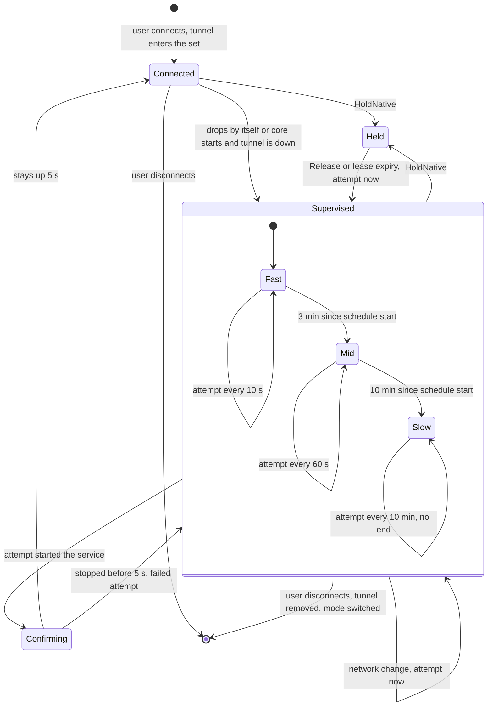

<a href="supervisor.md">English</a> | <b>Русский</b>

# Надзор: как туннели держатся подключёнными

Надзор — поток службы ядра (`retry`, запускается в `serve_until_stopped` файла `src/daemon/server.rs`). Он единственный хозяин переподключений: возвращает каждый
туннель, который пользователь оставил подключённым, — после перезагрузки, пропадания питания, перезапуска ядра или обрыва. Решения — чистый код в
`src/daemon/retry.rs` (время передаётся параметром, расписание проверяется тестами без часов и служб); применяет их `Core::supervise_tick` в
`src/daemon/server.rs` обычным переключением.

## Желаемый набор

1. Набор туннелей, которые пользователь хочет держать подключёнными, — ключ `tunnels` секции `[core]` в `core.ini`
   (`C:\ProgramData\AmneziaWG UI Dark\core.ini`), список через запятую; ключ `multiple` хранит выбор «несколько туннелей одновременно» последнего подключения
   (`src/daemon/mod.rs`, `Config`).
2. Набор меняют только команды пользователя (`src/daemon/restore.rs`, `after_switch`):
   1. `Switch` с `Connect` добавляет туннель; заменённые им туннели из набора уходят.
   2. `Switch` с `Disconnect` убирает туннель; `Reconnect` оставляет.
   3. `SetMode` очищает набор (туннели прежнего режима отключены намеренно).
   4. Удаление и переименование туннеля убирает или переименовывает его запись.
3. Набор **не** меняется, когда туннель упал сам или Windows выключается: ради этого случая набор и существует.
4. Имена при чтении файла фильтруются правилом имён туннелей. Не записался набор — предупреждение в журнал; в памяти новый набор действует, но после
   перезагрузки вернётся прежний.
5. В `core.ini` прежней версии ключа `tunnels` нет: набор неизвестен. Через `ADOPT_AFTER` (30 с, чтобы службы туннелей успели подняться) набором становятся
   работающие туннели (`multiple` истинно, если работает больше одного), и надзор делает первый такт. Явно пустой ключ остаётся пустым.

## Расписание

Желаемый туннель, который не работает, получает запись (`Track`) со своим расписанием. Такт надзора — 1 с (`TICK`). Точные числа:

| Константа | Значение | Смысл |
|---|---|---|
| `FAST_EVERY` | 10 с | пауза между попытками в первой фазе |
| `FAST_FOR` | 3 мин | первая фаза длится, пока с начала расписания не прошло столько |
| `MID_EVERY` | 60 с | пауза во второй фазе |
| `SLOW_FROM` | 10 мин | начало третьей фазы |
| `SLOW_EVERY` | 10 мин | пауза в третьей фазе, бессрочно (владелец может быть далеко от машины) |
| `NETWORK_MIN_GAP` | 3 с | внеочередная попытка по смене сети — не раньше, чем через столько после предыдущей |
| `CONFIRM_FOR` | 5 с | столько туннель должен проработать, чтобы считаться подключённым |
| `MAX_LEASE` | 60 мин | дольше одна аренда не держит туннель вне надзора |
| `AFTER_LEASE` | 30 мин | после того как аренда истекла сама, пропажа службы режима 1 значит «вернуть», а не «убран в окне AmneziaWG» |

1. **Фазы.** Пауза до следующей попытки выбирается по времени с начала расписания: меньше 3 мин — 10 с; от 3 до 10 мин — 60 с; 10 мин и больше — 10 мин.
   Расписание начинается, когда туннель найден неработающим (или по `Retry`, или при возврате аренды).
2. **Первая попытка.**
   1. После запуска ядра (первый такт) туннель без службы пробуется сразу; туннель, у которого служба есть, — через 10 с: Windows как раз может поднимать эту
      службу сама.
   2. Упал позже — первая попытка через 10 с.
   3. `Retry` из окна или возврат аренды — сразу, расписание с начала.
3. **Попытка.** Обычный `Switch` с `Connect` (источник «надзор») под блокировкой `switching` ядра. Если туннель уже работает, больше не желаемый или
   арендован, она ничего не делает; что дальше — решит следующий такт.
4. **Подтверждение.** Поднявшаяся служба ещё не «подключён»: `tunnel.dll` сообщает «работает» до настройки адресов интерфейса, а она ещё может сорваться
   (`Element not found`, код 1168) — служба тогда встаёт через долю секунды. Туннель считается подключённым только после `CONFIRM_FOR`; остановка раньше — это
   неудачная попытка с причиной остановки службы (или «туннель остановился сразу после запуска»), расписание продолжается.
5. **Туннель, поднявшийся сам** (Windows запустила службу после загрузки), тоже наблюдается `CONFIRM_FOR` и выходит из-под надзора с записью «Подключён».
6. **Список работающих не прочитался — новых решений нет**; уже назначенные попытки идут, их ошибки видны в журнале.
7. **Хозяин переподключений один.** В режиме 2 ядро при подготовке режима убирает у служб туннелей действие Windows «перезапуск при сбое»
   (`engine::clear_restart_on_failure`): два механизма пересоздавали бы одну службу наперегонки.

## Смена сети

`src/daemon/netwatch.rs`: поток спит в `NotifyAddrChange` и при каждой смене адресов увеличивает счётчик. Надзор сравнивает счётчик на каждом такте. При смене
следующая попытка каждой записи переносится на «сейчас», но не раньше `NETWORK_MIN_GAP` после её последней попытки (Windows шлёт уведомления пачкой);
запись, ждущая подтверждения, не пробуется. Это работает в любой фазе, в том числе в третьей. Сломалось ожидание — одно предупреждение в журнал, и надзор дальше идёт
только по расписанию.

## Восстановление после загрузки, пропадания питания и перезапуска ядра

1. Служба ядра запускается вместе с Windows (`SERVICE_AUTO_START`); при сбое диспетчер служб перезапускает её через 5 с (три действия перезапуска, счётчик
   сбоев сбрасывается через сутки). Ядро и само завершается с кодом сбоя, если погиб один из его фоновых потоков, — диспетчер перезапустит службу.
2. Первый такт надзора и есть восстановление: каждый туннель набора, который не работает, получает запись по правилу первой попытки выше.
3. В режиме 1 (службы принадлежат AmneziaWG) туннель, который работал и чья служба пропала после первого такта, считается убранным в окне AmneziaWG:
   он выходит из набора с информационной записью в журнале и не поднимается обратно (это значило бы спорить с пользователем).
   Исключение — туннель, чья аренда истекла сама (см. «Истечение» ниже).
4. Туннель, который пользователь переключает прямо сейчас (помечен занятым), не трогается.

## HoldNative и Release при обновлениях

Менеджер обновлений живёт в агенте и просит ядро по каналу (только от SYSTEM, см. [Протоколы](protocols.ru.md)) аренду туннелей на время установки или удаления
оригинального AmneziaWG: MSI убирает службы туннелей режима 1, и надзор, пересоздающий их, гонялся бы с установщиком. Ход обновления — [Обновления](updates.ru.md).

1. `HoldNative { lease_s }` берётся под блокировкой `switching` (идущее переключение доходит до конца). Какие туннели, решает ядро, а не менеджер (у агента
   своих сведений о туннелях нет): в режиме 1 — работающие и желаемые (желаемый упавший надзор иначе поднимал бы наперегонки с MSI), в режиме 2 — никакие.
   Ответ `Held` — взятые; их же менеджер возвращает `Release`. Список работающих не прочитался — ошибка, аренды нет. Взятые туннели:
   1. туннели теряют записи и не пробуются, из набора не выводятся, даже если их служба исчезла;
   2. они помечаются занятыми (`busy.update`): окно показывает их занятыми, а отключение не считается аварией;
   3. аренда кончается через `lease_s` от сейчас, но не позже `MAX_LEASE` (60 мин); менеджер просит 15 мин; повторный `HoldNative` продлевает срок.
2. Ядро недоступно или аренду не дало — MSI не запускается: туннели без аренды надзор вывел бы из набора (служба пропала), а гонка с надзором хуже
   отложенного обновления. Ядро ничего не взяло (режим 2, в режиме 1 туннелей нет) — MSI идёт без аренды.
3. `Release { tunnels }` возвращает аренду при любом исходе работы. Желаемые неработающие туннели подключаются сразу обычным переключением (расписание с
   начала), а не на следующем такте: в режиме 1 следующий такт увидел бы туннель без службы и счёл его убранным в окне AmneziaWG. Список работающих не
   прочитался — попытка всем возвращённым желаемым.
4. **Истечение.** Аренда, которую держатель так и не вернул (менеджер завис или погиб), кончается сама. Такт, заметивший это, пишет предупреждение и сразу
   пробует желаемые неработающие туннели. Все желаемые туннели истёкшей аренды помечаются «вернуть» (`Retries::after_lease`): установщик мог убрать
   службу до истечения или, зависнув, после него, и это не воля пользователя. Помеченный туннель без службы получает попытку сразу и обычное
   расписание (`connect` ставит службу из конфига), а не выходит из набора. Пометка снимается, когда туннель проработал `AFTER_LEASE` (30 мин) после
   истечения, вышел из набора, получил команду пользователя или новую аренду. В режиме 1 помеченный неработающий туннель, чьего конфига у AmneziaWG
   больше нет, выходит из набора с предупреждением: подключать нечего. Список конфигов не прочитался — туннель остаётся.
5. После обновления движка менеджер шлёт `ReconnectEngine`: на ближайшем такте ядро переподключает работающие туннели режима 2 с пометкой «занят» (это команда,
   а не авария). Ядро в ответе его не дожидается.

## Диаграмма состояний

По одному туннелю желаемого набора (`Retries`, `Track`):

Подписи диаграммы на английском: те же, что на английской странице. Команда пользователя над туннелем (`Switch`) сразу снимает его запись: пользователь взял дело на себя.
`Retry` запускает запись заново в фазе `Fast` с немедленной попыткой. Смена режима очищает все записи.

## Что пишется в журнал и когда

В журнал событий (`events.log`, его показывает окно) надзор пишет такие строки; язык — язык окна:

| Событие | Важность | Когда |
|---|---|---|
| `Переподключение <t>: попытка N, ошибка: ...` | предупреждение | каждая неудачная попытка в фазах 1 и 2 |
| `Не удалось подключить <t> за 10 минут: .... Дальше — попытка раз в 10 минут` | ошибка, с уведомлением | один раз, при входе в фазу 3; попытки фазы 3 по одной **не** пишутся |
| `<t> подключён после N попыток` | информация | туннель подтверждён после хотя бы одной попытки ядра, в любой фазе |
| `Подключён` | информация | туннель поднялся без попытки ядра (подтверждён через 5 с) |
| `Переподключение <t>: заново по команде пользователя` | информация | `Retry` |
| `<t> отключён вне программы (его службы нет): переподключаться не будет` | информация | режим 1, служба убрана в окне AmneziaWG |
| `<t>: вне надзора до N с, пока ставится AmneziaWG` | информация | `HoldNative` |
| `<t>: аренда истекла, а туннель так и не вернули — надзор идёт снова` | предупреждение | аренда кончилась сама |
| `<t>: аренда истекла, а у AmneziaWG этого туннеля больше нет (конфиг удалён): он убран из туннелей, которые нужно держать подключёнными` | предупреждение | режим 1, после истёкшей аренды, конфига нет |
| `Туннели для восстановления после перезапуска взяты из работающих: ...` | информация | принятие работающих туннелей (прежний `core.ini`) |
| `Список туннелей для восстановления после перезапуска не сохранён: ...` | предупреждение | не записался `core.ini` |
| `Смена сети не отслеживается, переподключение — только по расписанию: ...` | предупреждение | отказал наблюдатель адресов (один раз) |
| `Отклонён внутренний запрос ядру не от системной учётной записи (учётная запись <SID>)` | предупреждение | `HoldNative`, `Release` и подобные от клиента не SYSTEM |

Сам обрыв («Туннель отключился») пишет монитор, когда подключённый туннель пропадает без команды (туннель, который переключается по команде, помечен занятым, и его
остановка не авария). Ошибки собственного `Switch` пользователя ядро пишет сразу. Окно видит и живое состояние: `CoreState.retries` (попытка, секунды до следующей,
последняя ошибка, `slow`) и `busy`.
